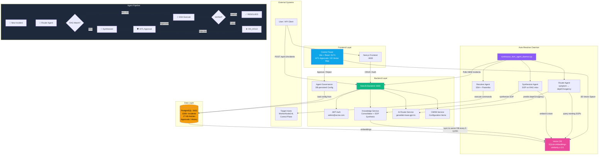
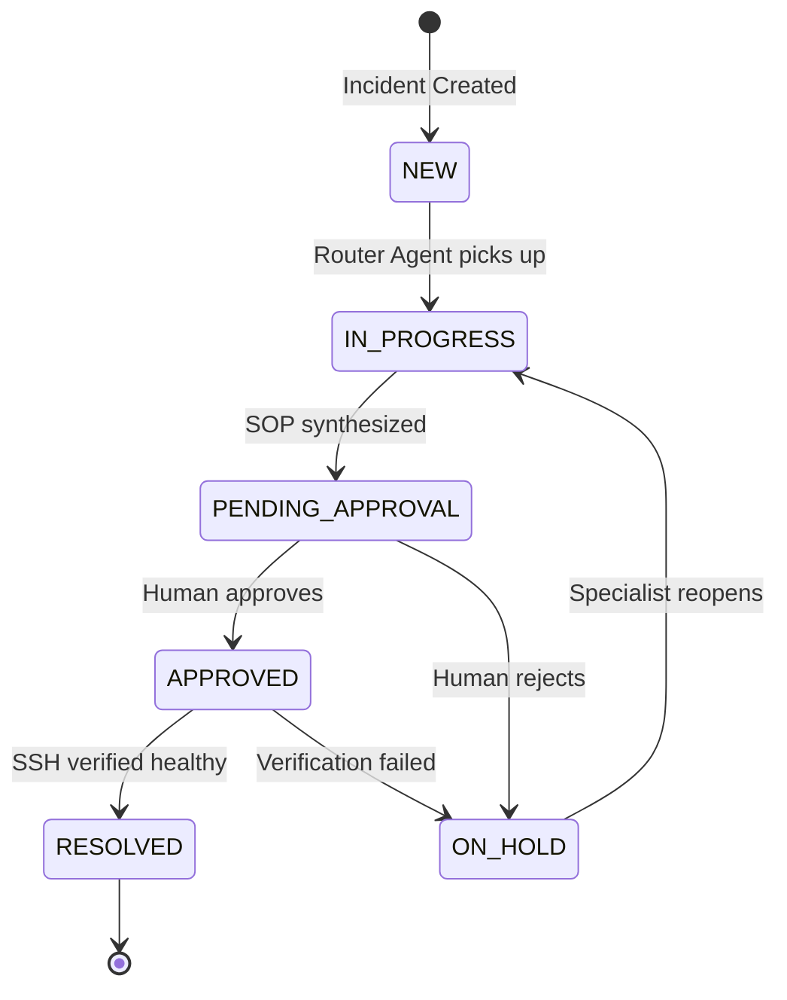

# Enterprise ITSM Platform & Autonomous Multi-Agent Resolver System

An end-to-end, enterprise-grade **IT Service Management (ITSM) Platform** with an **Autonomous Multi-Agent AI Engine** capable of automated ticket routing, non-interactive SSH remote remediation, live host health verification, master SOP synthesis, state machine loop protection, and strict Human-in-the-Loop (HITL) governance.

## System Architecture Flowchart



### Agent Pipeline States



### 4-Agent Roles

| Agent | Engine | Role |
|-------|--------|------|
| **Router Agent** | genailab-maas-gpt-4o (DB config) | Parse symptoms, predict dept/CI/urgency, set SLA priority |
| **Resolver Agent** | Python daemon + Paramiko SSH | OS fingerprinting, non-interactive SSH execution, live health verification |
| **Knowledge Synthesizer** | azure/genailab-maas-gpt-4.1-mini | Root-cause analysis, SOP synthesis on RAG miss, embed to vector DB |
| **HITL Control Tower** | Vite + React | Risk evaluation, interactive approval cards, 3D vector map, session locks |

---

## Services & Ports

| Service | Port | URL |
|---------|------|-----|
| PostgreSQL 18 | `5432` | `localhost:5432` |
| NestJS Backend | `4000` | `http://localhost:4000/api/v1` |
| Next.js Frontend | `3000` | `http://localhost:3000` |
| Control Tower | `5173` | `http://localhost:5173` |
| Auto-Resolver Daemon | — | Background Python process |

---

## Infrastructure

### Registered CIs

| CI Name | IP | SSH User | OS |
|---------|-----|----------|-----|
| Control Plane | `192.168.100.101` | root / root123 | Linux |
| WorkerNode1HL | `192.168.100.102` | root / root123 | Linux |
| Worker1OL | `192.168.56.10` | root / root123 | Linux |

### AI Model Configuration (DB-persisted)

| Role | Model | Provider |
|------|-------|----------|
| Router | `genailab-maas-gpt-4o` | genailab (primary) |
| Resolver | `azure/genailab-maas-gpt-4.1-mini` | genailab |
| Synthesizer | `azure_ai/genailab-maas-Llama-4-Maverick-17B-128E-Instruct-FP8` | genailab |
| Governance | `genailab-maas-gpt-4o` | genailab |
| Embeddings | `azure/genailab-maas-text-embedding-3-large` | genailab |
| LLM Fallback | `nvidia/llama-3.3-nemotron-super-49b-v1` | NVIDIA |

### Auth Credentials

| Field | Value |
|-------|-------|
| Login URL | `POST /api/v1/auth/login` |
| Email | `admin@acme.com` |
| Password | `Admin123!` |

---

## Quick Start

### 1. Clone & Install

```bash
git clone https://github.com/Venuvgp19/ITSM-Agentic.git
cd ITSM-Agentic
npm install
cd "Resolver Agent" && pip install -r requirements.txt && cd ..
```

### 2. Database Setup

```powershell
# PostgreSQL must be running on port 5432
# Create database and user
$env:PGPASSWORD='itsm_password'
& "C:\Program Files\PostgreSQL\18\bin\psql.exe" -h 127.0.0.1 -p 5432 -U postgres -c "CREATE USER itsm_user WITH PASSWORD 'itsm_password';"
& "C:\Program Files\PostgreSQL\18\bin\psql.exe" -h 127.0.0.1 -p 5432 -U postgres -c "CREATE DATABASE itsm_db OWNER itsm_user;"

# Restore from dump
& "C:\Program Files\PostgreSQL\18\bin\psql.exe" -h 127.0.0.1 -p 5432 -U itsm_user -d itsm_db -f packages/db/prisma/seed-data.sql
```

### 3. Start Backend

```powershell
# Must start via Start-Process (PowerShell & operator doesn't work)
Start-Process cmd.exe "/c cd apps\backend && npm run start:dev" -WindowStyle Minimized
```

### 4. Start Frontend

```powershell
Start-Process cmd.exe "/c cd apps\frontend && npm run dev" -WindowStyle Minimized
```

### 5. Start Control Tower

```powershell
Start-Process cmd.exe "/c cd "Resolver Agent\agent-approval-dashboard" && npx vite --port 5173" -WindowStyle Minimized
```

### 6. Start Auto-Resolver Daemon

```powershell
Start-Process cmd.exe "/c cd "Resolver Agent" && python continuous_itsm_agent_daemon.py" -WindowStyle Minimized
```

### 7. Verify All Services

```powershell
# Check all ports
@(5432, 4000, 3000, 5173) | ForEach-Object {
    $l = Get-NetTCPConnection -LocalPort $_ -ErrorAction SilentlyContinue | Where-Object { $_.State -eq 'Listen' } | Select-Object -First 1
    if ($l) { "Port $_ : OK" } else { "Port $_ : DOWN" }
}

# Check backend health
Invoke-RestMethod -Uri "http://localhost:4000/api/v1/knowledge/articles" -Headers @{Authorization = "Bearer <token>"}
```

---

## All Relevant Commands

### Service Management

```powershell
# --- Start Services ---
Start-Process cmd.exe "/c cd apps\backend && npm run start:dev" -WindowStyle Minimized
Start-Process cmd.exe "/c cd apps\frontend && npm run dev" -WindowStyle Minimized
Start-Process cmd.exe "/c cd "Resolver Agent\agent-approval-dashboard" && npx vite --port 5173" -WindowStyle Minimized
Start-Process cmd.exe "/c cd "Resolver Agent" && python continuous_itsm_agent_daemon.py" -WindowStyle Minimized

# --- Kill a Service (find PID first) ---
Get-Process node | Where-Object {$_.MainWindowTitle -match "backend"} | Stop-Process -Force
Get-Process python | Where-Object {$_.MainWindowTitle -match "daemon"} | Stop-Process -Force

# --- Restart Backend (wait 3s for TIME_WAIT) ---
Stop-Process -Name node -Force -ErrorAction SilentlyContinue; Start-Sleep 3; Start-Process cmd.exe "/c cd apps\backend && npm run start:dev" -WindowStyle Minimized
```

### Database Operations

```powershell
# --- Connect to PostgreSQL ---
$env:PGPASSWORD='itsm_password'
& "C:\Program Files\PostgreSQL\18\bin\psql.exe" -h 127.0.0.1 -p 5432 -U itsm_user -d itsm_db

# --- Restore Database ---
& "C:\Program Files\PostgreSQL\18\bin\psql.exe" -h 127.0.0.1 -p 5432 -U itsm_user -d itsm_db -f packages/db/prisma/seed-data.sql

# --- Dump Database ---
& "C:\Program Files\PostgreSQL\18\bin\pg_dump.exe" -h 127.0.0.1 -p 5432 -U itsm_user -d itsm_db --no-owner --no-privileges > packages/db/prisma/seed-data.sql

# --- Useful Queries ---
# List all tables
\dt

# Count incidents
SELECT COUNT(*) FROM "Incident";

# List KB articles
SELECT number, title FROM "KnowledgeArticle" ORDER BY number;

# Check agent config
SELECT * FROM "AgentConfig";

# Find incidents by state
SELECT number, state, priority FROM "Incident" WHERE state = 'NEW' LIMIT 10;
```

### API Authentication

```powershell
# --- Get JWT Token ---
$body = @{email = "admin@acme.com"; password = "Admin123!"} | ConvertTo-Json
$res = Invoke-RestMethod -Uri "http://localhost:4000/api/v1/auth/login" -Method POST -Body $body -ContentType "application/json"
$token = $res.accessToken
$headers = @{Authorization = "Bearer $token"}

# --- Use Token for API Calls ---
Invoke-RestMethod -Uri "http://localhost:4000/api/v1/incidents" -Headers $headers
Invoke-RestMethod -Uri "http://localhost:4000/api/v1/knowledge/articles" -Headers $headers
Invoke-RestMethod -Uri "http://localhost:4000/api/v1/cmdb/ci" -Headers $headers
```

### Create Ticket via API (triggers full agent pipeline)

```powershell
$body = @{
    title = "Create user john on WorkerNode1HL"
    description = "Create user account john on WorkerNode1HL with sudo access"
    category = "User Management"
    priority = "HIGH"
} | ConvertTo-Json
Invoke-RestMethod -Uri "http://localhost:4000/api/v1/incidents" -Method POST -Body $body -ContentType "application/json" -Headers $headers
```

### Daemon Operations

```powershell
# --- Check daemon logs ---
Get-Content "$env:TEMP\opencode\daemon.log" -Tail 50

# --- Check backend logs ---
Get-Content "C:\Users\GENAIMXQROUSR12\ITSM-Agentic\apps\backend\backend.log" -Tail 50

# --- Check daemon PID ---
Get-Content "Resolver Agent\daemon.lock"

# --- Force kill daemon ---
Remove-Item "Resolver Agent\daemon.lock" -Force
Get-Process python | Stop-Process -Force -ErrorAction SilentlyContinue
```

### Vector DB Operations

```powershell
# --- Query vector DB (Python) ---
python -c "
import sqlite3
conn = sqlite3.connect('Resolver Agent/vector_db.db')
for row in conn.execute('SELECT number, title FROM kb_embeddings ORDER BY number'):
    print(f'{row[0]}: {row[1][:70]}')
conn.close()
"

# --- Sync vector DB from API ---
python -c "
import sqlite3, requests
token = '<JWT_TOKEN>'
headers = {'Authorization': f'Bearer {token}'}
res = requests.get('http://localhost:4000/api/v1/knowledge/articles', headers=headers)
articles = res.json()
conn = sqlite3.connect('Resolver Agent/vector_db.db')
existing = {r[0] for r in conn.execute('SELECT number FROM kb_embeddings').fetchall()}
for a in articles:
    if a['number'] not in existing:
        conn.execute('INSERT INTO kb_embeddings (id, number, title, embedding) VALUES (?, ?, ?, ?)',
                     (a['id'], a['number'], a['title'], '[]'))
conn.commit()
conn.close()
print(f'Synced {len(articles)} articles')
"
```

### PuTTY / SSH Operations

```powershell
# --- Remote command execution ---
& "C:\Program Files\PuTTY\plink.exe" -ssh root@192.168.100.102 -pw root123 "hostname && uptime"

# --- File transfer ---
& "C:\Program Files\PuTTY\pscp.exe" -pw root123 localfile.txt root@192.168.100.102:/tmp/
```

---

## Knowledge Base Articles (17 SOPs)

| KB Number | Title | Category |
|-----------|-------|----------|
| KB0000001 | Master User Account Creation & Provisioning | User Management |
| KB0000002 | Core Router High Latency Troubleshooting | Application - Code & SSO Fix |
| KB0000003 | NexaCore Application Recovery & Self-Healing | Application / Web Services |
| KB0000005 | Okta MFA Webhook Delivery Timeout | User Error - Training Provided |
| KB0000006 | SSSD LDAP Provider Connection Refusal | Server - Kernel & OS Patch |
| KB0000007 | Email Gateway Outbound Mail Queue Backlog | Application - Code & SSO Fix |
| KB0000008 | PostgreSQL Primary Node Replication Lag | Network - BGP & Interface Reset |
| KB0000009 | Kubernetes Node & Kubelet Recovery | User Error - Training Provided |
| KB0000010 | IPsec X.509 Certificate Renewal | Server - Kernel & OS Patch |
| KB0000011 | AWS East Region DB Connection Timeout | Application - Code & SSO Fix |
| KB0000012 | Printer Spooler Offline - London HQ | Network - BGP & Interface Reset |
| KB0000013 | Active Directory LDAP Sync Failure | User Error - Training Provided |
| KB0000014 | User Account Offboarding & Deletion | User Management |
| KB0000015 | User Account Lock & Unlock | User Management |
| KB0000016 | Kubernetes Ingress Controller High CPU | Network - BGP & Interface Reset |
| KB0000017 | User Password Reset | User Management |
| KB0000018 | SAP ERP Financials SSO Auth Failure | Network - BGP & Interface Reset |

---

## API Endpoints

### Incidents
| Method | Endpoint | Description |
|--------|----------|-------------|
| `GET` | `/api/v1/incidents` | List all incidents |
| `GET` | `/api/v1/incidents/:id` | Get incident by ID |
| `POST` | `/api/v1/incidents` | Create new incident |
| `PATCH` | `/api/v1/incidents/:id` | Update incident |
| `POST` | `/api/v1/incidents/:id/activities` | Add work note |
| `DELETE` | `/api/v1/incidents/:id/activities/:activityId` | Delete work note |

### Knowledge Base
| Method | Endpoint | Description |
|--------|----------|-------------|
| `GET` | `/api/v1/knowledge/articles` | List all KB articles |
| `GET` | `/api/v1/knowledge/articles/:number` | Get by number (e.g. KB0000001) |
| `POST` | `/api/v1/knowledge/articles` | Create KB article |
| `PUT` | `/api/v1/knowledge/articles/:id` | Update KB article |
| `DELETE` | `/api/v1/knowledge/articles/:id` | Delete KB article |

### Agent Governance
| Method | Endpoint | Description |
|--------|----------|-------------|
| `GET` | `/api/v1/agent/approvals` | List approval requests |
| `POST` | `/api/v1/agent/approvals` | Create approval |
| `POST` | `/api/v1/agent/approvals/:id/approve` | Approve SOP |
| `POST` | `/api/v1/agent/approvals/:id/reject` | Reject SOP |
| `GET` | `/api/v1/agent/history` | Agent execution history |
| `DELETE` | `/api/v1/agent/history/:id` | Delete history entry |
| `POST` | `/api/v1/agent/reset-locks` | Reset stuck session locks |

### CMDB
| Method | Endpoint | Description |
|--------|----------|-------------|
| `GET` | `/api/v1/cmdb/ci` | List all CIs |
| `POST` | `/api/v1/cmdb/ci` | Register new CI |
| `GET` | `/api/v1/cmdb/ci/:id` | Get CI details |

### Authentication
| Method | Endpoint | Description |
|--------|----------|-------------|
| `POST` | `/api/v1/auth/login` | Login, returns JWT |
| `POST` | `/api/v1/auth/register` | Register new user |

---

## Daemon Safety Rules

### User Creation (KB0000001)
- Username validation: first command must be `id -u {username}` — aborts if exists
- Sudo stripping: sudoers commands removed if not requested
- ACL mode: write access to /etc replaced with `setfacl`
- Force-change stripping: `passwd -e` removed if not requested

### User Deletion (KB0000014)
- Archive before delete: `tar czf /tmp/{username}_home.tar.gz /home/{username}`
- Kill processes: `pkill -u {username}`

### Password Reset (KB0000017)
- Force-change: `passwd -e {username}` appended if "force" or "expire" mentioned
- Default: `echo {username}:{password} | chpasswd`

### Lock/Unlock (KB0000015)
- Lock: "lock", "disable", "brute force" → `passwd -l {username}`
- Unlock: "unlock", "enable" → `passwd -u {username}`

---

## State Machine

```
NEW → IN_PROGRESS → PENDING_APPROVAL → APPROVED → RESOLVED
                                           ↓
                                        ON_HOLD (rejected / verification failed)
```

- Session locking: escalated incidents get in-memory locks preventing daemon re-polling
- HITL gate: HIGH risk commands require human approval in Control Tower
- SOP parameterization: LLM replaces `{ip}`, `{username}`, `{password}` placeholders

---

## Project Structure

```
ITSM-Agentic/
├── apps/
│   ├── backend/              # NestJS REST API (port 4000)
│   │   └── src/modules/
│   │       ├── incidents/    # Incident CRUD + state machine
│   │       ├── knowledge/    # KB articles + Knowledge Consolidator
│   │       ├── ai-router/    # Router Agent + LLM service
│   │       ├── agent-governance/  # Approval workflow + DB config
│   │       └── cmdb/         # Configuration Items
│   └── frontend/             # Next.js UI (port 3000)
├── Resolver Agent/
│   ├── agent-approval-dashboard/  # Control Tower (Vite, port 5173)
│   │   └── src/components/
│   │       ├── VectorSpace3D.tsx   # 3D KB visualization
│   │       ├── PendingApprovalsView.tsx
│   │       └── IncidentAnalysisView.tsx
│   ├── continuous_itsm_agent_daemon.py  # Auto-Resolver daemon
│   ├── agent_unix_resolver.py     # SSH execution module
│   ├── vector_db.db               # RAG vector embeddings (SQLite)
│   └── requirements.txt           # Python dependencies
├── packages/
│   └── db/
│       └── prisma/
│           ├── schema.prisma      # Database schema
│           └── seed-data.sql      # Full DB dump (1000+ incidents)
├── docker-compose.yml
├── package.json                    # Root workspace config
└── README.md
```

---

## Database Schema (Core Tables)

| Table | Records | Description |
|-------|---------|-------------|
| `Incident` | 1000+ | Incident tickets with state machine |
| `KnowledgeArticle` | 17 | SOPs, runbooks, diagnostic procedures |
| `AgentApproval` | 100+ | HITL approval requests and decisions |
| `AgentHistory` | 100+ | Agent execution audit trail |
| `AgentConfig` | 1 | AI model configuration (persisted in DB) |
| `ConfigurationItem` | 3+ | Servers, workstations |
| `Problem` | — | Problem management records |
| `ChangeRequest` | — | Change management records |
| `User` | — | Platform users |
| `Tenant` | 1 | Multi-tenant isolation |

---

## Troubleshooting

### Backend won't start (port in use)
```powershell
# Wait for TIME_WAIT sockets to clear
Start-Sleep 3
# Or kill existing node processes
Get-Process node | Stop-Process -Force
```

### Daemon won't start (lock file)
```powershell
# Remove stale lock file
Remove-Item "Resolver Agent\daemon.lock" -Force
```

### Vector DB out of sync with API
```powershell
# Check counts
python -c "import sqlite3; print(sqlite3.connect('Resolver Agent/vector_db.db').execute('SELECT COUNT(*) FROM kb_embeddings').fetchone()[0])"
# Re-sync via daemon (runs every 5 cycles) or manually via API
```

### PostgreSQL connection refused
```powershell
# Check if PostgreSQL is running
Get-Service | Where-Object {$_.Name -match "postgres"}
# Check port
Get-NetTCPConnection -LocalPort 5432 -ErrorAction SilentlyContinue
```

---

## License

MIT License. See `LICENSE` for details.
