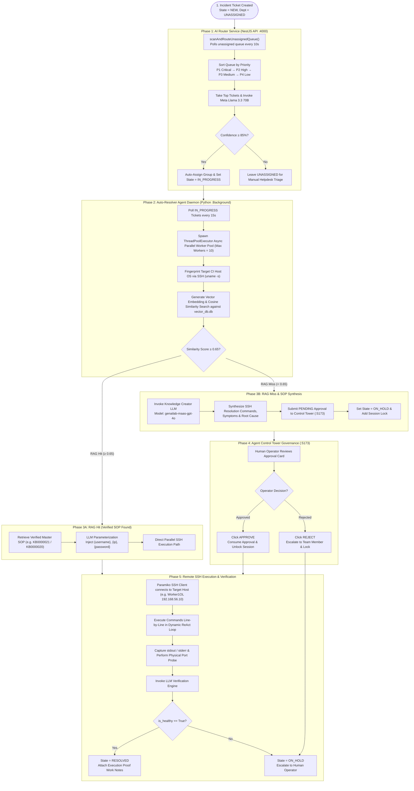

# Autonomous ITSM Platform & Multi-Agent Resolver System

An enterprise-grade **IT Service Management (ITSM) Platform** featuring an **Autonomous Multi-Agent AI Engine**. 
The system autonomously triages incoming helpdesk tickets, retrieves verified SOPs via dense vector RAG (4096-D embeddings with **0.65 match threshold**), executes SSH remediation routines on target servers in **Async Parallel Worker Pools (up to 10+ concurrent tickets)**, synthesizes new knowledge on RAG misses, and enforces strict Human-in-the-Loop (HITL) governance.

---

## 🏛️ Architecture & System Flowchart



---

## 💾 Full Database Dump & Data Files (1,079 Incidents Included)

The repository includes complete, pre-seeded data dump files containing **1,079 Incidents**, Master Knowledge SOPs, Agent Approvals, and Audit Logs so you can clone and restore the entire platform environment instantly:

1. **`itsm_db_dump.sql`** (2.61 MB): Complete PostgreSQL schema + data dump (`1,079 Incidents`).
2. **`data_dump.json`** (2.91 MB): Structured JSON dump file of all 1,079 incidents and Master SOPs.
3. **`Resolver Agent/vector_db.db`**: SQLite database storing 100% indexed SOP vector embeddings.
4. **`apps/backend/data/knowledge_articles.json`**: Master Knowledge Base JSON store (`KB0000001` - `KB0000088`).

---

## 🛠️ Complete Setup & Operations Guide

### 1. Restore PostgreSQL Database Dump (`itsm_db_dump.sql`)

```powershell
# Windows (PowerShell)
# 1. Create database user & database
& "C:\Program Files\PostgreSQL\18\bin\psql.exe" -U postgres -c "CREATE USER itsm_user WITH PASSWORD 'itsm_password';"
& "C:\Program Files\PostgreSQL\18\bin\psql.exe" -U postgres -c "CREATE DATABASE itsm_db OWNER itsm_user;"
& "C:\Program Files\PostgreSQL\18\bin\psql.exe" -U postgres -c "GRANT ALL PRIVILEGES ON DATABASE itsm_db TO itsm_user;"

# 2. Restore complete 1079 incidents database dump
& "C:\Program Files\PostgreSQL\18\bin\psql.exe" -U itsm_user -d itsm_db -f "itsm_db_dump.sql"
```

```bash
# Linux / macOS
psql -U postgres -c "CREATE USER itsm_user WITH PASSWORD 'itsm_password';"
psql -U postgres -c "CREATE DATABASE itsm_db OWNER itsm_user;"
psql -U postgres -c "GRANT ALL PRIVILEGES ON DATABASE itsm_db TO itsm_user;"

# Restore dump file
psql -U itsm_user -d itsm_db -f "itsm_db_dump.sql"
```

---

### 2. Install Project & Workspace Dependencies

```bash
# Root Node.js Dependencies
npm install

# Agent Control Tower Dashboard Dependencies
cd "Resolver Agent/agent-approval-dashboard" && npm install && cd ../..

# Python Resolver Agent Daemon Dependencies
cd "Resolver Agent" && pip install -r requirements.txt && cd ..
```

---

### 3. Build Backend & Packages

```bash
npm run build:backend
```

---

### 4. Launch Entire Service Stack (Concurrent Terminals)

```powershell
# Terminal 1: NestJS Backend REST API (Port 4000)
node apps/backend/dist/main.js

# Terminal 2: Next.js Helpdesk Portal & Dashboard (Port 3000)
npm --prefix apps/frontend run dev

# Terminal 3: Agent Control Tower Server (Port 5173)
cd "Resolver Agent/agent-approval-dashboard"
node server.js

# Terminal 4: Python Auto-Resolver Daemon (Async Parallel Worker Pool)
cd "Resolver Agent"
python continuous_itsm_agent_daemon.py
```

---

### 5. Access Dashboards in Web Browser

- **ITS Console & Incidents Portal (1,079 Incidents)**: [http://localhost:3000](http://localhost:3000)
- **All Incidents Stream**: [http://localhost:3000/incidents](http://localhost:3000/incidents)
- **Agent Control Tower & HITL Approvals**: [http://localhost:5173](http://localhost:5173)
- **NestJS REST API Base**: [http://localhost:4000/api/v1](http://localhost:4000/api/v1)

---

### 6. Verify & Create Test Incidents

```powershell
# Authenticate & Retrieve Token
$body = @{ email = "admin@acme.com"; password = "Admin123!" } | ConvertTo-Json
$res = Invoke-RestMethod -Uri "http://localhost:4000/api/v1/auth/login" -Method POST -Body $body -ContentType "application/json"
$token = $res.accessToken
$headers = @{ Authorization = "Bearer $token" }

# 1. Create NexaCore Recovery Incident on Worker1OL
$inc1 = @{
    title = "NexaCore Enterprise Portal unreachable on worker1OL port 8080"
    shortDescription = "NexaCore Enterprise Portal unreachable on worker1OL port 8080"
    description = "NexaCore Web application returning HTTP 502 connection refused on worker1OL port 8080"
    category = "Unix - OS & Services"
    configurationItem = "Worker 1"
    priority = "P2"
    state = "IN_PROGRESS"
} | ConvertTo-Json

Invoke-RestMethod -Uri "http://localhost:4000/api/v1/incidents" -Method POST -Body $inc1 -ContentType "application/json" -Headers $headers

# 2. Create Custom User Provisioning Incident on Worker1OL
$inc2 = @{
    title = "create user ID ignio on Worker1OL and set password root123"
    shortDescription = "create user ID ignio on Worker1OL and set password root123"
    description = "Create user ID ignio on Worker1OL, set password to root123. Configure sudoers so ignio can ONLY execute /usr/bin/passwd command without issuing any password."
    category = "Unix - OS & Services"
    configurationItem = "Worker 1"
    priority = "P3"
    state = "IN_PROGRESS"
} | ConvertTo-Json

Invoke-RestMethod -Uri "http://localhost:4000/api/v1/incidents" -Method POST -Body $ticket2 -ContentType "application/json" -Headers $headers
```

---

## 📁 Repository Directory Structure

```
ITSM-Agentic/
├── apps/
│   ├── backend/                      # NestJS REST API Server (Port 4000)
│   │   └── data/
│   │       └── knowledge_articles.json # Master Knowledge Articles DB
│   └── frontend/                     # Next.js Helpdesk Portal & Dashboard (Port 3000)
│       └── src/app/
│           ├── dashboard/            # Home Dashboard (Shows Total 1,079 Incidents KPI)
│           ├── incidents/            # Incident Stream & Detail Views
│           └── governance/           # AI Governance & Audit History
├── Resolver Agent/
│   ├── agent-approval-dashboard/     # Control Tower Dashboard (Port 5173)
│   ├── continuous_itsm_agent_daemon.py # Python Async Parallel Worker Daemon
│   ├── vector_db.db                  # SQLite Vector Database Embeddings
│   └── requirements.txt              # Python Agent dependencies
├── itsm_db_dump.sql                  # Complete PostgreSQL Database Dump (1,079 Incidents)
├── data_dump.json                    # Structured JSON Data Dump File
├── package.json                      # Workspace Root Configuration
└── README.md                         # Operations & Architecture Guide
```

---

## 📄 License
MIT License - Autonomous ITSM Agentic Platform
