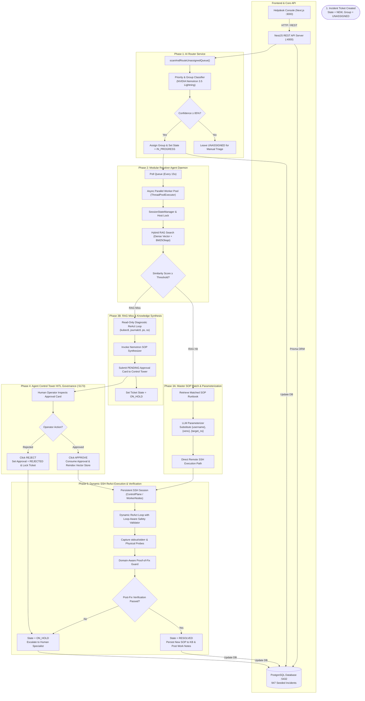

# 🚀 Enterprise Autonomous ITSM Platform & Multi-Agent AI Resolver System

An enterprise-grade, autonomous **IT Service Management (ITSM) Platform** powered by a **Multi-Agent Artificial Intelligence Engine** and **NVIDIA NIM LLMs** (NVIDIA Nemotron 3.5 Lightning, Llama 3.3 70B, DeepSeek R1).

The platform automates enterprise helpdesk operations end-to-end: autonomous ticket routing and classification, Hybrid Dense & Lexical Vector RAG (ChromaDB 4096-D NV-Embed-v1 + BM25Okapi via Reciprocal Rank Fusion), loop-aware command validation, remote persistent SSH remediation, autonomous post-fix verification, self-learning SOP synthesis, and Human-in-the-Loop (HITL) governance through the **Agent Control Tower Dashboard**.

---

## 📋 Table of Contents
1. [Key Features & Platform Capabilities](#-key-features--platform-capabilities)
2. [Multi-Agent System Architecture](#-multi-agent-system-architecture)
3. [Modular Resolver Agent Daemon Architecture](#-modular-resolver-agent-daemon-architecture)
4. [Hybrid RAG & SOP Synthesis Engine](#-hybrid-rag--sop-synthesis-engine)
5. [Safety, Validation & Guardrails](#-safety-validation--guardrails)
6. [System Requirements & Prerequisites](#-system-requirements--prerequisites)
7. [Installation & Strict Application Startup Sequence](#-installation--strict-application-startup-sequence)
8. [Database & Vector Store Restoration](#-database--vector-store-restoration)
9. [Active Service URLs & Port Reference](#-active-service-urls--port-reference)
10. [Verification & System Testing](#-verification--system-testing)
11. [Complete Repository Structure](#-complete-repository-structure)
12. [License](#-license)

---

## 🌟 Key Features & Platform Capabilities

- **Autonomous Incident Triage & AI Routing**: Real-time evaluation of incoming tickets by priority (P1 Critical to P4 Low), predicting operational assignment groups with high confidence (≥ 85%) and auto-assigning for remediation.
- **Hybrid RAG Retrieval Engine**: Combines dense vector semantic search (4096-D `nvidia/nv-embed-v1` embeddings in ChromaDB) and BM25Okapi lexical retrieval using Reciprocal Rank Fusion (RRF) and an LLM RAG Judge.
- **Generic Master SOP & Dynamic Parameterization**: Reusable parameterized SOP blueprints for Linux user management, Kubernetes/ArgoCD operations, IBM DB2, Jenkins secrets, Cloud CLIs, and Python environments.
- **Dynamic ReAct Execution Loops**:
  - *Read-Only Diagnostic Loop*: Live non-destructive telemetry gathering on target hosts before formulating a solution.
  - *Remediation Loop*: Dynamic SSH command execution guided by approved runbooks with per-turn tool calling.
- **Loop-Aware Command Safety Validator**: Shell parser supporting complex bash constructs (`for` loops, `while` loops, pipelines) while strictly validating that every inner invoked binary matches the approved SOP.
- **Mandatory Domain-Aware Proof-of-Fix Guard**: Verifies real infrastructure health (e.g. Kubernetes Pod Phase == `Running`, Linux User ID existence/deletion, HTTP 200 health probes) before marking tickets as `RESOLVED`.
- **Self-Learning Knowledge Base Synthesizer**: Automatically writes and persists newly discovered and verified SOPs to the knowledge base and indexes them in ChromaDB.
- **Centralized Thread-Safe Session State**: Encapsulates runtime session tracking, per-host execution locks, and per-incident token cost accounting in `SessionStateManager`.
- **Agent Control Tower Dashboard**: Vite/React real-time HITL dashboard featuring approval cards, timeline traces, audit logs, and live execution abort controls.

---

## 🤖 Multi-Agent System Architecture



---

## 🏛️ Modular Resolver Agent Daemon Architecture

The Resolver Agent daemon has been refactored into a structured, modular Python package located at [`Resolver Agent/daemon/`](file:///c:/Users/praka/OneDrive/Desktop/ITSM-Agentic/Resolver%20Agent/daemon/):

```
Resolver Agent/
├── continuous_itsm_agent_daemon.py   # Executable entrypoint & backward-compatible module exporter
└── daemon/
    ├── __init__.py                   # Package re-exports (88 public symbols)
    ├── config.py                     # Configuration constants, model routing, CI credentials, PID lock
    ├── session_state.py              # Thread-safe SessionStateManager (per-host locks, token accounting)
    ├── llm.py                        # LLM invocation with fallback & token tracking, thinking cleaner
    ├── orchestrator/
    │   ├── __init__.py               # Orchestrator interface
    │   ├── incident_lifecycle.py     # Incident state machine transitions, work notes, verification
    │   └── poller.py                 # Queue polling timer loop, ChromaDB sync, ThreadPool worker pool
    ├── itsm/
    │   ├── client.py                 # REST API client (login, incident queue, KB articles, status)
    │   └── dashboard.py              # Control Tower HITL approval submissions, audit history, timelines
    ├── rag/
    │   ├── bm25.py                   # BM25Okapi lexical retrieval & tokenization
    │   ├── vector_db.py              # ChromaVectorDB & LocalVectorDB persistent cosine similarity indexes
    │   ├── hybrid_search.py          # Hybrid RRF search, query distillation, fallback search
    │   └── judge.py                  # LLM RAG judge for cross-domain validation
    ├── react/
    │   ├── diagnostic_loop.py        # Read-only diagnostic ReAct loop for live cluster/host inspection
    │   ├── remediation_loop.py       # Dynamic execution ReAct loop with loop-aware command safety guard
    │   └── post_verification.py      # Domain-aware post-remediation verification & health checks
    ├── safety/
    │   ├── rules.py                  # Code-level safety enforcement (sudoers, passwords, user rules)
    │   ├── relevance_audit.py        # Post-synthesis relevance judge & entity validator
    │   └── validator.py              # Shell syntax parser (for/while loops) & allowed binary adaptation checker
    ├── sop/
    │   └── synthesizer.py            # RAG SOP retrieval, LLM synthesis, parameterization & relevance auditing
    └── ssh/
        ├── sanitization.py           # SSH command wrapper stripper
        └── session.py                # PersistentSSHSession, direct command execution, OS fingerprinting
```

---

## 🧠 Hybrid RAG & SOP Synthesis Engine

### RAG Retrieval Formula
Retrieval combines dense semantic similarity and BM25Okapi lexical matching via Reciprocal Rank Fusion (RRF):

$$\text{RRF Score} = \frac{w_{\text{dense}}}{60 + \text{Rank}_{\text{dense}}} + \frac{w_{\text{lexical}}}{60 + \text{Rank}_{\text{lexical}}}$$

$$\text{Blended Score} = 0.55 \times \text{Dense Score} + 0.45 \times \text{Normalized RRF Score}$$

### Pre-Configured Master SOPs

| IT Domain | Master SOP | Parameter Placeholders | Scope |
| :--- | :--- | :--- | :--- |
| **User Account Provisioning** | `KB0000028` | `{username}`, `{password}`, `{group}` | Standard & privileged Linux user creation |
| **User Account Deprovisioning** | `KB0000038` | `{username_list}`, `{username}` | Single & bulk user deletion, sudoers purge |
| **Cloud CLI / DevOps Tooling** | `KB0000045` | `{ci_name}`, `{os_type}` | Azure CLI installation, package verification |
| **Python Virtual Environments** | `KB0000019` | `{venv_name}`, `{packages}` | Python venv provisioning & package installation |
| **Kubernetes & ArgoCD** | `KB0000039` | `{target_ns}`, `{deployment_name}` | Pod/Deployment health recovery, namespace restarts |
| **Jenkins Secrets & Credentials**| `KB0000041` | `{service_name}`, `{secret_path}` | Initial admin password & credential retrieval |
| **IBM DB2 Management** | `KB0000033` | `{db2_user}`, `{access_level}` | DB2 instance administration, CloudBeaver access |
| **System Performance & Triage** | `KB0468210` | `{ci_name}`, `{threshold_type}` | CPU/Memory pressure triage and process diagnostics |

---

## 🛡️ Safety, Validation & Guardrails

1. **Loop-Aware Binary Validator**: Allows bash loop syntax (e.g., `for user in ...; do ... done`) while extracting every inner binary (`rm`, `pkill`, `userdel`, `id`) and confirming it is present in the approved SOP.
2. **Action Direction & Domain Guard**: Prevents cross-domain entity matching (e.g. Kubernetes scheduling tickets matching Linux user SOPs, or Deletion tickets matching Creation SOPs).
3. **Mandatory Post-Fix Verification**:
   - *Kubernetes*: Queries `kubectl get pod <name> -o jsonpath='{.status.phase}'` to guarantee the pod reached `Running` or `Completed`.
   - *Linux Users*: Runs `id <user>` to verify existence (for creation) or confirm removal (for deletion).
   - *Web Apps*: Probes live HTTP/TCP ports (e.g. `http://<ip>:8080`) to ensure socket binding.
4. **Session State Isolation**: `SessionStateManager` prevents duplicate concurrent execution on the same ticket across worker threads.

---

## ⚙️ System Requirements & Prerequisites

### Hardware
- **CPU**: 4 Cores (x86_64 or ARM64)
- **RAM**: 8 GB minimum (16 GB recommended)
- **Storage**: 10 GB free space

### Software Dependencies
| Software | Minimum Version | Purpose |
| :--- | :--- | :--- |
| **Node.js** | `>= 18.16.0` (LTS) | NestJS Backend API & Next.js Frontend Portal |
| **npm** | `>= 9.0.0` | Package management |
| **Python** | `>= 3.10.0` | Auto-Resolver Agent Daemon & ChromaDB Vector Store |
| **PostgreSQL** | `>= 15.0` | Primary Relational Database (`itsm_db`) |
| **Git** | `>= 2.30.0` | Version control |

---

## 🚀 Installation & Strict Application Startup Sequence

To ensure database consistency and avoid duplicate executions, follow the startup sequence defined in [`.agents/AGENTS.md`](file:///c:/Users/praka/OneDrive/Desktop/ITSM-Agentic/.agents/AGENTS.md):

### 1. Start Local PostgreSQL Database (`port 5432`)
```powershell
& "$env:USERPROFILE\pgsql\pgsql\bin\postgres.exe" -D "$env:USERPROFILE\pgsql\pgsql\data"
```

### 2. Build Backend & MCP Server
```bash
npm run build:backend
npm run build:mcp
```

### 3. Start NestJS Backend API Server (`port 4000`)
```bash
node apps/backend/dist/main.js
```

### 4. Start Next.js Frontend Dev Server (`port 3000`)
```bash
npm run dev:frontend
```

### 5. Start Agent Control Tower Dashboard Server (`port 5173`)
```bash
cd "Resolver Agent/agent-approval-dashboard"
node server.js
```

### 6. Start Python Auto-Resolver Agent Daemon
```bash
cd "Resolver Agent"
python -u continuous_itsm_agent_daemon.py
```

### 7. Start ITSM MCP Server
```bash
npm run start:mcp
```

---

## 💾 Database & Vector Store Restoration

The repository includes a single source-of-truth PostgreSQL database dump and pre-indexed ChromaDB vector embeddings:

- **[`database_dump.sql`](file:///c:/Users/praka/OneDrive/Desktop/ITSM-Agentic/database_dump.sql)**: Complete PostgreSQL dump containing **947 Incidents**, **42 Master SOP Articles**, **90 Agent Approvals**, **306 Execution Audits**, and **50 Problem Records**.
- **[`Resolver Agent/chroma_db`](file:///c:/Users/praka/OneDrive/Desktop/ITSM-Agentic/Resolver%20Agent/chroma_db)**: Persistent ChromaDB HNSW vector index files for all Master SOPs.

### To Restore Database:
```bash
psql -U postgres -d itsm_db -f database_dump.sql
```
*(Or execute `python import_repo_data_dump.py` to restore automatically via script)*

---

## 🌐 Active Service URLs & Port Reference

| Service | Host / Port | URL | Description |
| :--- | :--- | :--- | :--- |
| **Next.js Helpdesk Portal** | `localhost:3000` | [http://localhost:3000](http://localhost:3000) | Helpdesk console & ticket stream |
| **Agent Control Tower Dashboard** | `localhost:5173` | [http://localhost:5173](http://localhost:5173) | Real-time HITL approvals & agent controls |
| **NestJS REST API Server** | `localhost:4000` | [http://localhost:4000/api/v1](http://localhost:4000/api/v1) | Backend REST API & AI Router Service |
| **Swagger API Docs** | `localhost:4000` | [http://localhost:4000/api/docs](http://localhost:4000/api/docs) | Interactive OpenAPI documentation |
| **PostgreSQL Database** | `localhost:5432` | `postgresql://localhost:5432/itsm_db` | Core relational data store |
| **ChromaDB Vector Database** | Local / SQLite | `Resolver Agent/chroma_db` | Dense 4096-D NV-Embed-v1 Vector Store |

---

## 🧪 Verification & System Testing

### 1. Backend Health Check
```bash
curl http://localhost:4000/api/v1/health
```

### 2. Run Resolver Agent Unit Tests
```bash
python "C:\Users\praka\.gemini\antigravity\brain\8b77415d-c2d7-46fd-94f6-fe601397f3e9\scratch\test_session_state_and_di.py"
```

### 3. Test Ticket Creation & Automated Resolution
```powershell
$inc = @{
    title = "install az cli on WorkerNode1HL node"
    shortDescription = "install az cli on WorkerNode1HL node"
    description = "Azure CLI tool is missing on WorkerNode1HL host. Please install and verify az command."
    category = "DevOps Tooling & Cloud CLI"
    configurationItem = "WorkerNode1HL"
    priority = "P3"
    state = "IN_PROGRESS"
} | ConvertTo-Json

Invoke-RestMethod -Uri "http://localhost:4000/api/v1/incidents" -Method POST -Body $inc -ContentType "application/json"
```

---

## 📁 Complete Repository Structure

```
ITSM-Agentic/
├── apps/
│   ├── backend/                      # NestJS REST API Server (Port 4000)
│   │   ├── src/
│   │   │   ├── modules/
│   │   │   │   ├── ai-router/        # AI Ticket Classification & Routing
│   │   │   │   ├── incidents/       # Incident Lifecycle Management
│   │   │   │   ├── knowledge/       # Knowledge Base CRUD & Search
│   │   │   │   └── agent/           # Approvals, Timeline & History APIs
│   │   │   └── main.ts
│   │   └── package.json
│   └── frontend/                     # Next.js Helpdesk Portal & UI (Port 3000)
│       ├── src/                      # React Components & Dashboard Pages
│       └── package.json
├── packages/
│   ├── db/                           # Prisma ORM Schema & Migrations
│   └── mcp-server/                   # Model Context Protocol (MCP) Server
├── Resolver Agent/
│   ├── agent-approval-dashboard/     # HITL Control Tower Dashboard (Port 5173)
│   │   ├── src/                      # React + Vite Frontend
│   │   └── server.js                 # Dashboard Express Server
│   ├── chroma_db/                    # Persistent ChromaDB 4096-D Vector Store
│   ├── daemon/                       # Modular Resolver Agent Package
│   │   ├── config.py                 # Daemon configuration & credentials
│   │   ├── session_state.py          # Centralized SessionStateManager
│   │   ├── llm.py                    # LLM invocation & token accounting
│   │   ├── orchestrator/             # Poller & Incident Lifecycle modules
│   │   ├── itsm/                     # ITSM REST client & Dashboard modules
│   │   ├── rag/                      # BM25, ChromaDB, Hybrid search & Judge
│   │   ├── react/                    # Diagnostic, Remediation & Verification loops
│   │   ├── safety/                   # Safety rules, Relevance audit, Command validator
│   │   ├── sop/                      # SOP synthesizer & parameterization
│   │   └── ssh/                      # SSH session holding & wrapper sanitization
│   ├── continuous_itsm_agent_daemon.py # Daemon Entrypoint & Exporter
│   └── requirements.txt              # Python Dependencies
├── database_dump.sql                 # Consolidated PostgreSQL Clean SQL Dump
├── import_repo_data_dump.py          # Automated Database Restoration Utility
├── package.json                      # Root Monorepo Configuration
└── README.md                         # Project Documentation
```

---

## 📄 License

Distributed under the **MIT License**. Standard enterprise ITSM autonomous remediation platform.
