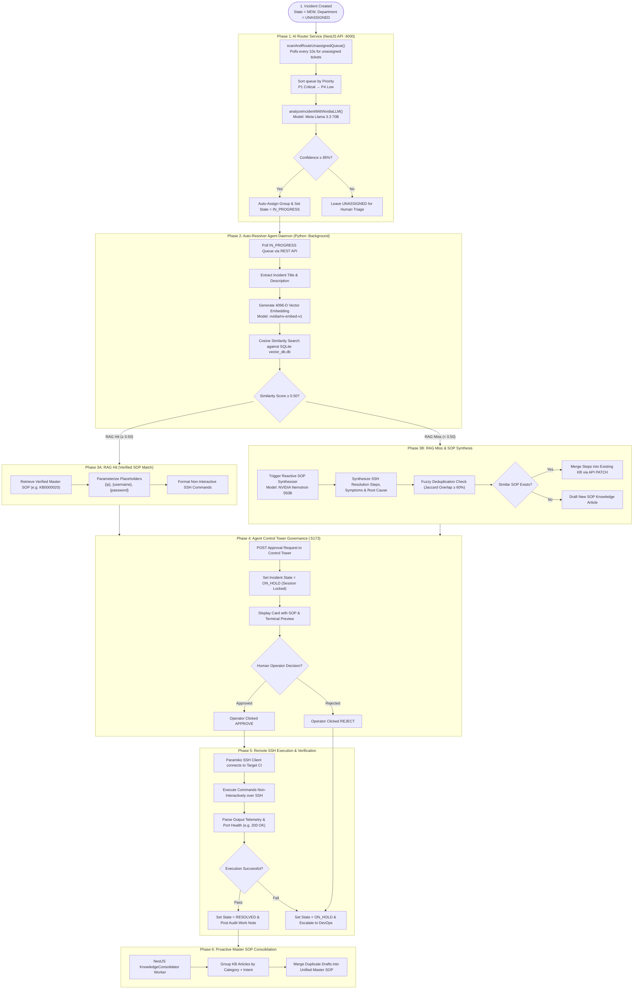

# Autonomous ITSM Platform & Multi-Agent Resolver System

An enterprise-grade **IT Service Management (ITSM) Platform** featuring an **Autonomous Multi-Agent AI Engine**. 
The system autonomously triages incoming helpdesk tickets, retrieves verified SOPs via dense vector RAG (4096-D embeddings), executes SSH remediation routines on target servers, synthesizes new knowledge on RAG misses, and enforces strict Human-in-the-Loop (HITL) governance.

---

## 🏛️ Architecture & Complete System Flow



---

## 🔍 How It Works: Detailed Explanation

### 1. Phase 1: Intelligent Ticket Triage & AI Routing
When an incident is logged in the system (via web portal, monitoring webhook, or API), its initial state is `NEW` and its department is `UNASSIGNED`. 
- The NestJS `AiRouterService` polls unassigned tickets every 10 seconds.
- It passes the ticket details to **Meta Llama 3.3 70B** to extract key telemetry, urgency, configuration item (CI), and assignment group.
- If the AI confidence score is **≥ 85%**, it automatically assigns the ticket and sets its state to `IN_PROGRESS`.

### 2. Phase 2: High-Precision Vector RAG Search
The Python Auto-Resolver Agent Daemon picks up tickets in `IN_PROGRESS` state:
- It strips out raw shell script noise and isolates clean `Title` + `Summary` text.
- It calls the **NVIDIA `nv-embed-v1`** model to generate a **4096-dimensional dense vector embedding**.
- It queries the local SQLite `vector_db.db` using Cosine Similarity.
- **Threshold Calibration (`0.50`):**
  - **Score ≥ 0.50 (RAG Hit):** Matches a verified Master SOP (e.g., `KB0000020` for NexaCore Application Recovery).
  - **Score < 0.50 (RAG Miss):** Triggers the reactive SOP synthesizer.

### 3. Phase 3: Reactive SOP Synthesis & Fuzzy Deduplication
If RAG misses:
- **NVIDIA Nemotron 550B** synthesizes a step-by-step recovery SOP based on incident telemetry and SSH diagnostic logs.
- **Fuzzy Token-Overlap Deduplicator:** Before creating a new KB, the daemon tokenizes keywords and calculates **Jaccard Token Overlap** against existing database SOPs. If a similar SOP exists (similarity ≥ 60%), it appends the new resolution commands to the existing KB via API `PATCH` instead of creating duplicate articles!

### 4. Phase 4: Human-in-the-Loop (HITL) Governance
Before any script touches a production server:
- The daemon submits an approval request to the **Agent Control Tower Dashboard** (`http://localhost:5173`).
- The incident state changes to `ON_HOLD` and a session lock is established.
- Human operators review the SOP steps, AI confidence score, and command preview before clicking **APPROVE** or **REJECT**.

### 5. Phase 5: Remote SSH Remediation & Verification
Upon operator approval:
- The daemon establishes a secure, non-interactive SSH connection (`Paramiko`) to the target server (e.g., `WorkerNode1HL` at `192.168.100.102`).
- It executes the resolution steps line-by-line and captures `stdout`/`stderr`.
- It performs a post-execution health check (e.g., verifying `HTTP 200 OK` on port `8080`).
- If healthy, the ticket state is updated to `RESOLVED`, audit work notes are attached, and the session lock is released.

### 6. Phase 6: Proactive Master SOP Consolidation
In the background, the NestJS `KnowledgeService` continuously scans all published KB articles. It groups them by **Category** + **Intent** (e.g., `User Management` + `CREATE`), deduplicates commands, and merges single articles into comprehensive **Master SOPs**.

---

## 🛠️ Complete Setup Commands

### Option A: Windows (PowerShell) - Full Manual Setup

#### 1. Database Setup & Restore
```powershell
# Ensure PostgreSQL is running on port 5432
# Create Database and User
& "$env:USERPROFILE\pgsql\pgsql\bin\psql.exe" -U postgres -c "CREATE USER postgres WITH PASSWORD 'postgres';"
& "$env:USERPROFILE\pgsql\pgsql\bin\psql.exe" -U postgres -c "CREATE DATABASE itsm_db OWNER postgres;"

# Restore Database Dump
& "$env:USERPROFILE\pgsql\pgsql\bin\psql.exe" -U postgres -d itsm_db -f packages/db/itsm_db_dump.sql
```

#### 2. Install Workspace Dependencies
```powershell
# Root Workspace Dependencies
npm install

# Agent Control Tower Dashboard Dependencies
cd "Resolver Agent\agent-approval-dashboard"
npm install
cd ..\..

# Python Resolver Daemon Dependencies
cd "Resolver Agent"
pip install -r requirements.txt
cd ..
```

#### 3. Rebuild Binaries
```powershell
npm run build:backend
npm run build:mcp
```

#### 4. Start All Services (Each in a New Terminal)
```powershell
# Terminal 1: NestJS Backend API (Port 4000)
node apps/backend/dist/main.js

# Terminal 2: Next.js Frontend (Port 3000)
npm run dev:frontend

# Terminal 3: Agent Control Tower Dashboard (Port 5173)
cd "Resolver Agent\agent-approval-dashboard"
node server.js

# Terminal 4: Python Auto-Resolver Daemon
cd "Resolver Agent"
Remove-Item "daemon.lock" -Force -ErrorAction SilentlyContinue
python -u continuous_itsm_agent_daemon.py
```

---

### Option B: Linux / macOS - Full Manual Setup

```bash
# 1. Database Setup
createdb -U postgres itsm_db
psql -U postgres -d itsm_db -f packages/db/itsm_db_dump.sql

# 2. Install Dependencies
npm install
cd "Resolver Agent/agent-approval-dashboard" && npm install && cd ../..
cd "Resolver Agent" && pip install -r requirements.txt && cd ..

# 3. Build Project
npm run build:backend
npm run build:mcp

# 4. Run Services
node apps/backend/dist/main.js &                       # Port 4000
npm run dev:frontend &                                  # Port 3000
node "Resolver Agent/agent-approval-dashboard/server.js" & # Port 5173
python3 -u "Resolver Agent/continuous_itsm_agent_daemon.py" &
```

---

## ⚡ Useful Operational Commands

### 1. Service Health & Port Inspection
```powershell
# Check if all required ports are active
@(5432, 4000, 3000, 5173) | ForEach-Object {
    $l = Get-NetTCPConnection -LocalPort $_ -ErrorAction SilentlyContinue | Where-Object { $_.State -eq 'Listen' }
    if ($l) { "Port $_ : ACTIVE 🟢" } else { "Port $_ : DOWN 🔴" }
}
```

### 2. Authenticate & Obtain JWT Bearer Token
```powershell
$body = @{ email = "admin@acme.com"; password = "Admin123!" } | ConvertTo-Json
$res = Invoke-RestMethod -Uri "http://localhost:4000/api/v1/auth/login" -Method POST -Body $body -ContentType "application/json"
$token = $res.accessToken
Write-Host "JWT Token: $token"
```

### 3. Create Test Incident via API (Triggers Full AI Pipeline)
```powershell
$headers = @{ Authorization = "Bearer $token" }
$body = @{
    title = "NexaCore Portal unresponsive on 192.168.100.102"
    description = "NexaCore web application returning HTTP 502 Bad Gateway on port 8080 on WorkerNode1HL."
    category = "Application / Web Services"
    priority = "HIGH"
} | ConvertTo-Json

Invoke-RestMethod -Uri "http://localhost:4000/api/v1/incidents" -Method POST -Body $body -ContentType "application/json" -Headers $headers
```

### 4. Force Restart Resolver Daemon (Clear Stale Lock)
```powershell
Stop-Process -Name python -Force -ErrorAction SilentlyContinue
Remove-Item "Resolver Agent\daemon.lock" -Force -ErrorAction SilentlyContinue
cd "Resolver Agent"
python -u continuous_itsm_agent_daemon.py
```

### 5. Export Fresh Database Dump
```powershell
& "$env:USERPROFILE\pgsql\pgsql\bin\pg_dump.exe" -U postgres -d itsm_db -F p -f "packages/db/itsm_db_dump.sql"
```

---

## 📁 Repository Directory Structure

```
ITSM-Agentic/
├── apps/
│   ├── backend/                      # NestJS REST API Server (Port 4000)
│   │   └── src/modules/
│   │       ├── ai-router/            # Llama 3.3 70B Ticket Triage & Routing
│   │       ├── knowledge/            # KB Management & Proactive Consolidator
│   │       ├── agent-governance/     # HITL Approval workflow & locks
│   │       └── incidents/            # Incident CRUD & state machine
│   └── frontend/                     # Next.js Helpdesk Web Portal (Port 3000)
├── Resolver Agent/
│   ├── agent-approval-dashboard/     # Control Tower Dashboard Server (Port 5173)
│   ├── continuous_itsm_agent_daemon.py # Main Python Resolver & Vector Search Daemon
│   ├── vector_db.db                  # SQLite 4096-D Vector DB Embeddings
│   └── requirements.txt              # Python Agent dependencies
├── packages/
│   └── db/
│       └── itsm_db_dump.sql          # Complete PostgreSQL Database Dump
├── assets/                           # Presentation UI Screenshots
├── presentation.html                 # Interactive Glassmorphism Sales Slide Deck
├── package.json                      # Workspace Root Configuration
└── README.md                         # Comprehensive Operations Guide
```

---

## 📄 License
MIT License - Autonomous ITSM Agentic Platform
