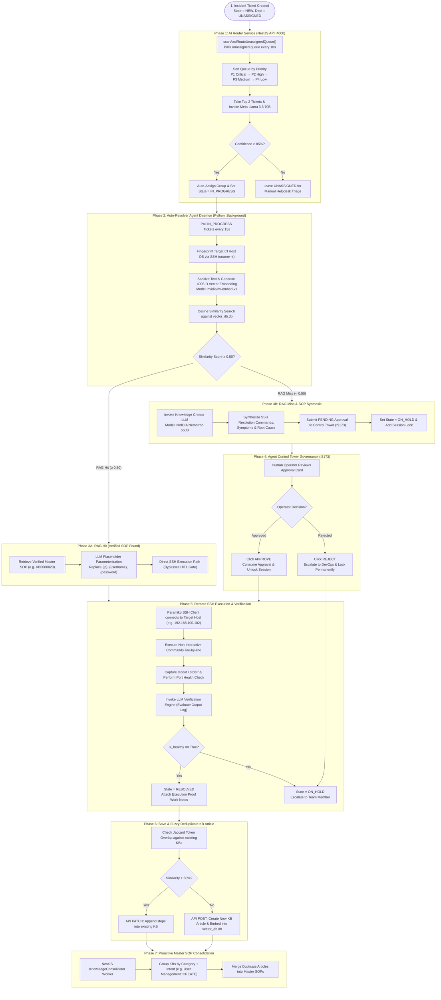

# Autonomous ITSM Platform & Multi-Agent Resolver System

An enterprise-grade **IT Service Management (ITSM) Platform** featuring an **Autonomous Multi-Agent AI Engine**. 
The system autonomously triages incoming helpdesk tickets, retrieves verified SOPs via dense vector RAG (4096-D embeddings), executes SSH remediation routines on target servers, synthesizes new knowledge on RAG misses, and enforces strict Human-in-the-Loop (HITL) governance.

---

## 🏛️ Exact Architecture & System Flowchart



---

## 🔍 Detailed Code-Flow Breakdown

### 1. Phase 1: AI Router Service (`AiRouterService`)
* **Trigger:** Polls unassigned tickets every 10,000ms (`apps/backend/src/modules/ai-router/ai-router.service.ts`).
* **Priority Queueing:** Sorts tickets strictly by priority: `P1 Critical` → `P2 High` → `P3 Medium` → `P4 Low`.
* **LLM Analysis:** Ingests top 2 tickets per cycle and invokes **Meta Llama 3.3 70B** (`llmService.analyzeIncidentWithNvidiaLLM`).
* **Routing Decision:**
  * If `confidenceScore >= 85%`: Updates ticket department, assigns technician, sets state to `IN_PROGRESS`, and posts audit work notes.
  * If `confidenceScore < 85%`: Leaves ticket `UNASSIGNED` for manual human triage.

### 2. Phase 2: Auto-Resolver Agent Daemon (`continuous_itsm_agent_daemon.py`)
* **Trigger:** Polls tickets in `IN_PROGRESS` state every 15 seconds.
* **CI Fingerprinting:** SSHes into the target host to fingerprint the OS (`uname -s`).
* **Resource Threshold Check:** For CPU/Memory alerts, captures live utilization via `top`/`free`. If utilization is `< 90%`, auto-resolves the ticket immediately.
* **Dense Vector Search:**
  * Extracts clean `Title` + `Summary` (excluding raw shell code noise).
  * Calls **NVIDIA `nv-embed-v1`** to generate a 4096-dimensional embedding.
  * Searches local SQLite `vector_db.db` via Cosine Similarity.

### 3. Phase 3 & 4: RAG Hit vs. RAG Miss (HITL Control Tower)
* **RAG Hit (`Similarity ≥ 0.50`):**
  * Retrieves verified SOP from PostgreSQL.
  * Parameterizes placeholders (`{ip}`, `{username}`, `{password}`).
  * **Direct Execution:** Bypasses approval and proceeds directly to SSH execution.
* **RAG Miss (`Similarity < 0.50`):**
  * Invokes Knowledge Creator LLM (**NVIDIA Nemotron 550B**) to synthesize new resolution commands.
  * Submits PENDING approval request to **Agent Control Tower Dashboard** (`http://localhost:5173`).
  * Changes ticket state to `ON_HOLD` and adds a session lock (`locked_incident_sessions.add(inc_id)`).
  * **Operator Decision:**
    * **APPROVE:** Daemon consumes approval, unlocks session, and executes approved commands.
    * **REJECT:** Daemon escalates ticket to `DevOps Team` and locks session permanently.

### 4. Phase 5: Remote SSH Execution & LLM Verification
* **Paramiko SSH Client:** Connects to target CI host (e.g., `WorkerNode1HL` at `192.168.100.102`).
* **Non-Interactive Execution:** Runs commands line-by-line and captures `stdout`/`stderr`.
* **Health Check:** Validates live port health (e.g., `HTTP 200 OK` on port `8080`).
* **LLM Verification Engine:** Passes execution output log to LLM (`invoke_llm_with_fallback`).
  * If `is_healthy == True`: State = `RESOLVED`, posts execution proof work notes.
  * If `is_healthy == False`: State = `ON_HOLD`, escalates to team member.

### 5. Phase 6: Save & Fuzzy Token-Overlap Deduplication
* **Jaccard Token Similarity:** Upon successful incident resolution of a new SOP, tokenizes the title keywords.
* **Overlap Check:** Compares against existing KB titles in PostgreSQL.
  * **Similarity ≥ 60%:** Merges new SSH steps into existing KB via API `PATCH`.
  * **Similarity < 60%:** Creates a new KB article via API `POST` and embeds it into `vector_db.db`.

### 6. Phase 7: Proactive Master SOP Consolidation
* **Background Worker:** NestJS `KnowledgeService` (`runContinuousBackgroundSynthesis`) scans published KBs.
* **Categorization & Intent Matching:** Groups articles by Category + Intent (e.g., `User Management::CREATE`).
* **Master SOP Generation:** Invokes LLM to merge duplicate single articles into clean **Master SOPs** (`KB00000xx`).

---

## 🛠️ Complete Operational Commands

### 1. Database Setup & Restore (PostgreSQL)

```powershell
# Windows (PowerShell)
& "$env:USERPROFILE\pgsql\pgsql\bin\psql.exe" -U postgres -c "CREATE USER postgres WITH PASSWORD 'postgres';"
& "$env:USERPROFILE\pgsql\pgsql\bin\psql.exe" -U postgres -c "CREATE DATABASE itsm_db OWNER postgres;"
& "$env:USERPROFILE\pgsql\pgsql\bin\psql.exe" -U postgres -d itsm_db -f packages/db/itsm_db_dump.sql
```

```bash
# Linux / macOS
psql -U postgres -c "CREATE USER postgres WITH PASSWORD 'postgres';"
createdb -U postgres -O postgres itsm_db
psql -U postgres -d itsm_db -f packages/db/itsm_db_dump.sql
```

### 2. Workspace Dependencies Installation

```bash
# Root & Workspace Dependencies
npm install

# Control Tower Dashboard Dependencies
cd "Resolver Agent/agent-approval-dashboard" && npm install && cd ../..

# Python Resolver Daemon Dependencies
cd "Resolver Agent" && pip install -r requirements.txt && cd ..
```

### 3. Build Project Binaries

```bash
npm run build:backend
npm run build:mcp
```

### 4. Launch Services (Individual Terminals)

```powershell
# Terminal 1: NestJS Backend API Server (Port 4000)
node apps/backend/dist/main.js

# Terminal 2: Next.js Frontend Dev Server (Port 3000)
npm run dev:frontend

# Terminal 3: Agent Control Tower Dashboard Server (Port 5173)
cd "Resolver Agent\agent-approval-dashboard"
node server.js

# Terminal 4: Python Auto-Resolver Daemon
cd "Resolver Agent"
Remove-Item "daemon.lock" -Force -ErrorAction SilentlyContinue
python -u continuous_itsm_agent_daemon.py
```

### 5. Health Check & API Verification Commands

```powershell
# Verify Port Listening Status
@(5432, 4000, 3000, 5173) | ForEach-Object {
    $l = Get-NetTCPConnection -LocalPort $_ -ErrorAction SilentlyContinue | Where-Object { $_.State -eq 'Listen' }
    if ($l) { "Port $_ : ACTIVE 🟢" } else { "Port $_ : DOWN 🔴" }
}

# Authenticate & Retrieve JWT Token
$body = @{ email = "admin@acme.com"; password = "Admin123!" } | ConvertTo-Json
$res = Invoke-RestMethod -Uri "http://localhost:4000/api/v1/auth/login" -Method POST -Body $body -ContentType "application/json"
$token = $res.accessToken

# Trigger Test Incident (NexaCore Recovery on WorkerNode1HL)
$headers = @{ Authorization = "Bearer $token" }
$ticketBody = @{
    title = "NexaCore Portal unresponsive on 192.168.100.102"
    description = "NexaCore web application returning HTTP 502 Bad Gateway on port 8080 on WorkerNode1HL."
    category = "Application / Web Services"
    priority = "HIGH"
} | ConvertTo-Json

Invoke-RestMethod -Uri "http://localhost:4000/api/v1/incidents" -Method POST -Body $ticketBody -ContentType "application/json" -Headers $headers
```

---

## 📁 Repository Directory Structure

```
ITSM-Agentic/
├── apps/
│   ├── backend/                      # NestJS REST API Server (Port 4000)
│   │   └── src/modules/
│   │       ├── ai-router/            # Llama 3.3 70B Ticket Triage & Routing
│   │       ├── knowledge/            # KB Management & Proactive Consolidator
│   │       ├── agent-governance/     # HITL Approval workflow & locks
│   │       └── incidents/            # Incident CRUD & state machine
│   └── frontend/                     # Next.js Helpdesk Web Portal (Port 3000)
├── Resolver Agent/
│   ├── agent-approval-dashboard/     # Control Tower Dashboard Server (Port 5173)
│   ├── continuous_itsm_agent_daemon.py # Main Python Resolver & Vector Search Daemon
│   ├── vector_db.db                  # SQLite 4096-D Vector DB Embeddings
│   └── requirements.txt              # Python Agent dependencies
├── packages/
│   └── db/
│       └── itsm_db_dump.sql          # Complete PostgreSQL Database Dump
├── assets/                           # Presentation UI Screenshots
├── presentation.html                 # Interactive Glassmorphism Sales Slide Deck
├── package.json                      # Workspace Root Configuration
└── README.md                         # Comprehensive Operations Guide
```

---

## 📄 License
MIT License - Autonomous ITSM Agentic Platform
