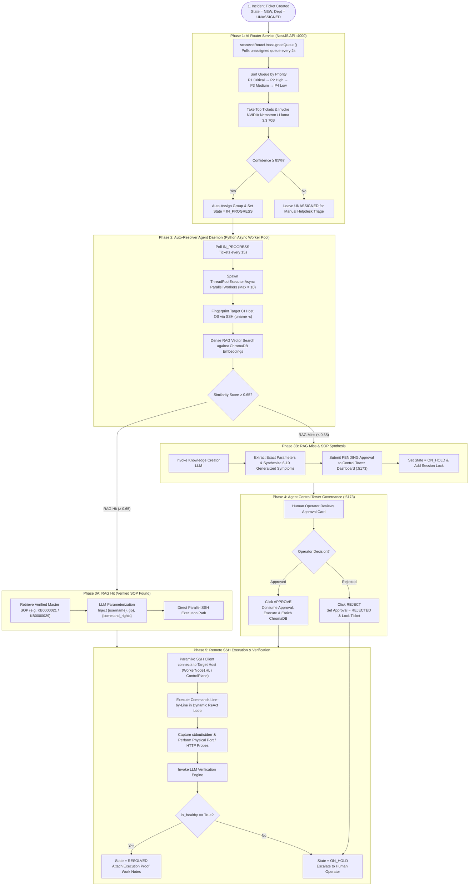

# 🚀 Enterprise Autonomous ITSM Platform & Multi-Agent Resolver System

An enterprise-grade **IT Service Management (ITSM) Platform** powered by an **Autonomous Multi-Agent AI Engine**. 
The system autonomously triages helpdesk tickets, retrieves verified SOP runbooks via Dense Vector RAG (ChromaDB 4096-D embeddings with **0.65 similarity threshold** & automatic symptom enrichment), executes remote SSH remediation routines on target infrastructure via **Async Parallel Worker Pools**, synthesizes L2 runbooks on RAG misses, and enforces Human-in-the-Loop (HITL) governance.

---

## 🏛️ Architecture & System Workflow



---

## 💾 Pre-Seeded Database & Environment Files

The repository includes complete, pre-seeded data files containing **1,079 Incidents**, Master Knowledge SOPs, Agent Approvals, and Audit Logs:

- **`itsm_db_dump.sql`**: Complete PostgreSQL schema + data dump (`1,079 Incidents`).
- **`data_dump.json`**: Structured JSON dump file of all 1,079 incidents and Master SOPs.
- **`Resolver Agent/chroma_db/`**: ChromaDB persistent vector database containing 4096-D embeddings.
- **`apps/backend/data/knowledge_articles.json`**: Master Knowledge Base JSON backup (`KB0000001` - `KB0000088`).

---

## 🛠️ Complete Step-by-Step Setup Guide

### 1. Database Restoration (PostgreSQL 15+)

#### Windows (PowerShell)
```powershell
# 1. Create database user & database
& "$env:USERPROFILE\pgsql\pgsql\bin\psql.exe" -U postgres -c "CREATE USER itsm_user WITH PASSWORD 'itsm_password';"
& "$env:USERPROFILE\pgsql\pgsql\bin\psql.exe" -U postgres -c "CREATE DATABASE itsm_db OWNER itsm_user;"
& "$env:USERPROFILE\pgsql\pgsql\bin\psql.exe" -U postgres -c "GRANT ALL PRIVILEGES ON DATABASE itsm_db TO itsm_user;"

# 2. Restore database dump (1,079 incidents)
& "$env:USERPROFILE\pgsql\pgsql\bin\psql.exe" -U itsm_user -d itsm_db -f "itsm_db_dump.sql"
```

#### Linux / macOS
```bash
psql -U postgres -c "CREATE USER itsm_user WITH PASSWORD 'itsm_password';"
psql -U postgres -c "CREATE DATABASE itsm_db OWNER itsm_user;"
psql -U postgres -c "GRANT ALL PRIVILEGES ON DATABASE itsm_db TO itsm_user;"

psql -U itsm_user -d itsm_db -f "itsm_db_dump.sql"
```

---

### 2. Workspace Dependencies Installation

```bash
# 1. Root Node.js Workspace Dependencies
npm install

# 2. Control Tower Dashboard Dependencies
cd "Resolver Agent/agent-approval-dashboard" && npm install && cd ../..

# 3. Python Auto-Resolver Agent Daemon Dependencies
cd "Resolver Agent" && pip install -r requirements.txt && cd ..
```

---

### 3. Compilation & Build

```bash
# Rebuild NestJS Backend API
npm run build:backend

# Build ITSM MCP Server
npm run build:mcp
```

---

### 4. ⚡ Standard Application Start Sequence

To bring the complete application stack online, launch services in the following order:

1. **Start PostgreSQL Database** (`port 5432`):
   ```powershell
   & "$env:USERPROFILE\pgsql\pgsql\bin\postgres.exe" -D "$env:USERPROFILE\pgsql\pgsql\data"
   ```
2. **Start NestJS Backend REST API Server** (`port 4000`):
   ```bash
   node apps/backend/dist/main.js
   ```
3. **Start Next.js Helpdesk Frontend** (`port 3000`):
   ```bash
   npm run dev:frontend
   ```
4. **Start Agent Control Tower Dashboard** (`port 5173`):
   ```bash
   cd "Resolver Agent/agent-approval-dashboard" && node server.js
   ```
5. **Start Python Auto-Resolver Agent Daemon**:
   ```bash
   cd "Resolver Agent" && python -u continuous_itsm_agent_daemon.py
   ```
6. **Start ITSM MCP Server**:
   ```bash
   npm run start:mcp
   ```

---

### 5. 🛑 Standard Application Teardown Sequence

When powering down the application stack, execute teardown in reverse order:

1. Stop Python Auto-Resolver Agent Daemon.
2. Stop ITSM MCP Server.
3. Stop Agent Control Tower Dashboard.
4. Stop Next.js Frontend Dev Server.
5. Stop NestJS Backend API Server.
6. Stop local PostgreSQL Database LAST.

---

## 🌐 Web Dashboards & Port Reference

- **ITS Console & Incidents Stream (1,079 Incidents)**: [http://localhost:3000](http://localhost:3000)
- **Agent Control Tower & HITL Approvals**: [http://localhost:5173](http://localhost:5173)
- **NestJS REST API Base**: [http://localhost:4000/api/v1](http://localhost:4000/api/v1)
- **Swagger OpenAPI Documentation**: [http://localhost:4000/api/docs](http://localhost:4000/api/docs)

---

## 🧪 Proven Enterprise Use Cases & Test Scripts

### 1. IBM DB2 User Provisioning & CloudBeaver UI Access
Creates containerized DB2 user, sets credentials non-interactively via `chpasswd`, grants SQL schema privileges, and verifies CloudBeaver access.

```powershell
$inc = @{
    title = "Create an IBM DB2 user venkat on the host WorkerNode1HL and provide cloudBeaver UI Access"
    shortDescription = "Create an IBM DB2 user venkat on the host WorkerNode1HL and provide cloudBeaver UI Access"
    description = "Create an IBM DB2 user venkat on WorkerNode1HL container db2server, set password, and grant DB2 CONNECT privileges."
    category = "Infrastructure > Database"
    configurationItem = "WorkerNode1HL"
    priority = "P2"
    state = "IN_PROGRESS"
} | ConvertTo-Json

Invoke-RestMethod -Uri "http://localhost:4000/api/v1/incidents" -Method POST -Body $inc -ContentType "application/json"
```

### 2. Restricted Granular Sudoers Delegation (`su - jboss`)
Creates OS users (`Pamsudo1..5`), provisions `.ssh` with `0700` permissions, and locks `/etc/sudoers.d/99-<user>` to **only** allow `NOPASSWD: /bin/su - jboss`.

```powershell
$inc = @{
    title = "create 5 users Pamsudo1 to pamsudo5, which has the capability to execute command like su - jboss on WorkerNode1HL"
    shortDescription = "create 5 users Pamsudo1 to pamsudo5 with su - jboss capabilities"
    description = "Create 5 users Pamsudo1 to Pamsudo5 on WorkerNode1HL with passwordless sudo restricted specifically to su - jboss."
    category = "Infrastructure > Unix"
    configurationItem = "WorkerNode1HL"
    priority = "P2"
    state = "IN_PROGRESS"
} | ConvertTo-Json

Invoke-RestMethod -Uri "http://localhost:4000/api/v1/incidents" -Method POST -Body $inc -ContentType "application/json"
```

### 3. NexaCore Application Recovery & Physical Port Probe
Remediates blocked ports or service crashes, executes `systemctl restart Nexacore`, and runs a physical HTTP probe against `http://192.168.100.102:8080`.

---

## 📁 Repository Structure

```
ITSM-Agentic/
├── apps/
│   ├── backend/                      # NestJS REST API Server (Port 4000)
│   │   └── src/                      # Controllers, Modules, & Prisma ORM
│   └── frontend/                     # Next.js Helpdesk Portal & Dashboard (Port 3000)
├── packages/
│   └── mcp-server/                   # ITSM Model Context Protocol (MCP) Server
├── Resolver Agent/
│   ├── agent-approval-dashboard/     # Control Tower HITL Dashboard (Port 5173)
│   ├── continuous_itsm_agent_daemon.py # Python Async Parallel Worker Daemon
│   ├── chroma_db/                    # Persistent Vector Database (4096-D Embeddings)
│   └── requirements.txt              # Python Dependencies
├── itsm_db_dump.sql                  # Complete PostgreSQL Dump (1,079 Incidents)
├── data_dump.json                    # Structured JSON Data Dump
├── package.json                      # Workspace Root Config
└── README.md                         # Architecture & Operations Guide
```

---

## 📄 License
MIT License - Autonomous Enterprise ITSM Agentic Platform
