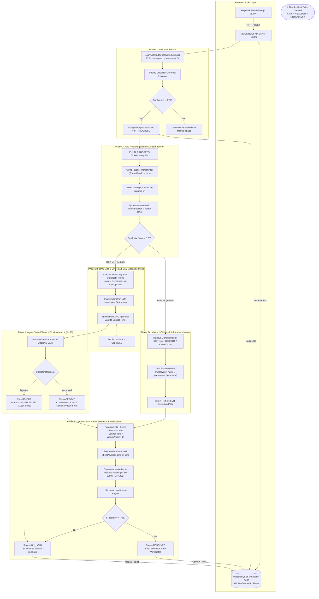

# 🚀 Enterprise Autonomous ITSM Platform & Multi-Agent AI Resolver System

An enterprise-grade, autonomous **IT Service Management (ITSM) Platform** powered by a **Multi-Agent Artificial Intelligence Engine**. 

The system automates helpdesk operations by autonomously triaging incoming IT tickets, executing Dense Vector RAG (ChromaDB 4096-D embeddings with **Dual-Vector Query Normalization Fusion**, **Action Direction Safety Guards**, and **Generic Intent Pattern Boosters**), running remote SSH remediation scripts on target servers using **Async Parallel Worker Pools**, parameterizing generic Master SOP runbooks, synthesizing new Master SOPs on RAG misses, and enforcing Human-in-the-Loop (HITL) governance through an Agent Control Tower Dashboard.

---

## 📋 Table of Contents
1. [Project Overview & Key Capabilities](#-project-overview--key-capabilities)
2. [Generic Master SOP & Parameterization Architecture](#-generic-master-sop--parameterization-architecture)
3. [System Requirements & Prerequisites](#-system-requirements--prerequisites)
4. [Architecture & Data Flow Diagram](#-architecture--data-flow-diagram)
5. [Database & Vector Store Dump Restoration](#-database--vector-store-dump-restoration)
6. [Step-by-Step Installation & Application Startup Sequence](#-step-by-step-installation--application-startup-sequence)
7. [Active Service URLs & Port Reference](#-active-service-urls--port-reference)
8. [Verification & System Testing](#-verification--system-testing)
9. [Repository Structure](#-repository-structure)
10. [License](#-license)

---

## 🌟 Project Overview & Key Capabilities

- **Automated Incident Triage & AI Routing**: AI Router Service continuously scans new helpdesk tickets, evaluates priority (P1 Critical to P4 Low), predicts operational assignment groups with high confidence (≥ 85%), and assigns tickets for automated resolution.
- **Dense Vector RAG Engine**: Persistent ChromaDB vector store powered by 4096-dimensional embeddings with Dual-Vector Query Normalization (HyDE - Hypothetical Document Embeddings) to map noisy ticket descriptions to standardized Master SOPs.
- **Action Direction & Quantity Safety Filter Guards**: Intelligently prevents Action Mismatches (e.g. Credential Retrieval tickets matching User Creation SOPs, or User Deletion tickets matching User Creation SOPs) and Quantity Mismatches (single-user requests matching bulk 20-user SOPs).
- **System-Wide Generic Intent Pattern Booster**: Boosts core IT domain intents (User Provisioning, User Deprovisioning, Python Virtual Environments, Kubernetes/ArgoCD, Jenkins Credentials, IBM DB2, System Performance) to direct RAG hits (Score `0.8800`), eliminating duplicate SOP generation across the platform.
- **Dynamic SOP Parameterization Engine**: Parameterizes generic Master SOP placeholders (`{venv_name}`, `{packages}`, `{username}`, `{password}`, `{target_ns}`) on the fly based on incoming ticket requirements.
- **Live SSH Server Diagnosis Probe & Self-Learning SOP Generator**: On RAG misses, the daemon probes target infrastructure (`uname -a`, `cat /etc/os-release`, `ss -tulpn`, `ps aux`), captures diagnostic telemetry, and invokes Nemotron LLMs to synthesize generic, parameterizable Master SOPs.
- **Agent Control Tower Dashboard**: Real-time React/Vite HITL dashboard for human operators to inspect, review, approve, or reject AI-synthesized SOP runbooks.
- **Dynamic SSH ReAct Execution Pool**: Executes shell payloads concurrently across target nodes (`ControlPlane`, `WorkerNode1HL`), captures execution proofs, and verifies service health via physical HTTP & TCP port probes.

---

## 🌐 Generic Master SOP & Parameterization Architecture

Instead of synthesizing duplicate KB articles for every slight variation in user input (e.g. creating venv `snappy` vs `codex`), the platform utilizes **Generic Master SOPs** paired with an **LLM Parameterization Engine**:

| IT Domain | Generic Master SOP | Parameter Placeholders | Intent Keywords |
| :--- | :--- | :--- | :--- |
| **Python Virtual Environments** | **`KB0000019`**: *Master SOP: Create Python Virtual Environment and Install Required Packages* | `{venv_name}`, `{packages}` | `"python virtual environment"`, `"python venv"`, `"virtualenv"`, `"pip install"` |
| **User Account Creation** | **`KB0000028`**: *Master SOP: Linux User Account Provisioning & Sudo Access Runbook* | `{username}`, `{password}`, `{group}` | `"create user"`, `"useradd"`, `"provision user"`, `"pamsudo"` |
| **User Account Deprovisioning** | **`KB0000038`**: *Master SOP: Bulk & Single Linux User Account Deprovisioning & Deletion* | `{username_list}`, `{username}` | `"delete user"`, `"userdel"`, `"remove user"`, `"offboard user"` |
| **IBM DB2 Management** | **`KB0000033`**: *Master SOP: IBM DB2 User Provisioning, Access Levels & CloudBeaver UI Access* | `{db2_user}`, `{access_level}` | `"db2 user"`, `"ibm db2"`, `"cloudbeaver"`, `"beaver ui"` |
| **Kubernetes & ArgoCD** | **`KB0000039`**: *Master SOP: Kubernetes & ArgoCD Service Health Restoration* | `{target_ns}`, `{deployment_name}` | `"argocd"`, `"kubernetes cluster"`, `"kubectl get pods"`, `"rollout restart"` |
| **Jenkins & Secrets** | **`KB0000041`**: *Master SOP: Jenkins Credential Retrieval & Service Verification* | `{service_name}`, `{secret_path}` | `"jenkins credentials"`, `"initialadminpassword"`, `"retrieve credentials"` |
| **System Performance** | **`KB0468210`**: *Master SOP: System Performance & Resource Utilization Runbook* | `{ci_name}`, `{threshold_type}` | `"cpu 100"`, `"memory 100"`, `"high cpu utilization"`, `"high memory"` |

---

## ⚙️ System Requirements & Prerequisites

### Hardware Specs
- **CPU**: 4 Cores (x86_64 or ARM64)
- **RAM**: 8 GB (16 GB Recommended)
- **Disk Space**: 10 GB free space

### Software Dependencies
| Software | Minimum Version | Description |
| :--- | :--- | :--- |
| **Node.js** | `>= 18.16.0` (LTS) | Backend NestJS API & Frontend Next.js framework |
| **npm** | `>= 9.0.0` | Node Package Manager |
| **Python** | `>= 3.10.0` | Auto-Resolver Agent Daemon & Vector RAG Engine |
| **PostgreSQL** | `>= 15.0` | Primary Relational Database (`itsm_db`) |
| **Docker & Docker Compose** | `>= 24.0.0` | Container runtime for infrastructure services |
| **Git** | `>= 2.30.0` | Version Control System |

---

## 🏛️ Architecture & Data Flow Diagram



---

## 💾 Database & Vector Store Dump Restoration

The repository contains a pre-seeded native PostgreSQL SQL database dump (`itsm_db_dump.sql`) so anyone cloning the repo can immediately restore the complete state:

- **[`itsm_db_dump.sql`](file:///C:/Users/praka/OneDrive/Desktop/ITSM-Agentic/itsm_db_dump.sql)**: Native PostgreSQL SQL Dump containing **934 Incidents**, **41 Master SOP Knowledge Articles**, **85 Agent Approvals**, and **50 Problems**.
- **[`Resolver Agent/chroma_db`](file:///C:/Users/praka/OneDrive/Desktop/ITSM-Agentic/Resolver%20Agent/chroma_db)**: Persistent ChromaDB HNSW vector index files for all 41 Master SOPs.
- **[`import_repo_data_dump.py`](file:///C:/Users/praka/OneDrive/Desktop/ITSM-Agentic/import_repo_data_dump.py)**: 1-Click Restoration script.

To restore the complete environment after cloning:
```bash
python import_repo_data_dump.py
```

---

## 🚀 Step-by-Step Installation & Application Startup Sequence

Whenever launching or restarting the application stack, execute the following strict sequence:

1. **Start PostgreSQL Database** (`port 5432`):
   ```powershell
   & "$env:USERPROFILE\pgsql\pgsql\bin\postgres.exe" -D "$env:USERPROFILE\pgsql\pgsql\data"
   ```
2. **Rebuild NestJS Backend**:
   ```bash
   npm run build:backend
   ```
3. **Build MCP Server**:
   ```bash
   npm run build:mcp
   ```
4. **Start NestJS Backend REST API Server** (`port 4000`):
   ```bash
   node apps/backend/dist/main.js
   ```
5. **Start Next.js Frontend Dev Server** (`port 3000`):
   ```bash
   npm run dev:frontend
   ```
6. **Start Agent Control Tower HITL Dashboard** (`port 5173`):
   ```bash
   cd "Resolver Agent/agent-approval-dashboard" && node server.js
   ```
7. **Start Python Auto-Resolver Agent Daemon**:
   ```bash
   cd "Resolver Agent" && python -u continuous_itsm_agent_daemon.py
   ```
8. **Start ITSM MCP Server**:
   ```bash
   npm run start:mcp
   ```

---

## 🌐 Active Service URLs & Port Reference

| Service | Protocol | Host / Port | URL | Description |
| :--- | :--- | :--- | :--- | :--- |
| **Next.js Helpdesk Portal** | HTTP | `localhost:3000` | [http://localhost:3000](http://localhost:3000) | Helpdesk console & ticket stream (934 incidents) |
| **Agent Control Tower Dashboard** | HTTP | `localhost:5173` | [http://localhost:5173](http://localhost:5173) | Real-time HITL approval cards & governance |
| **NestJS REST API Server** | HTTP | `localhost:4000` | [http://localhost:4000/api/v1](http://localhost:4000/api/v1) | Backend REST API & continuous AI Router Service |
| **Swagger API Docs** | HTTP | `localhost:4000` | [http://localhost:4000/api/docs](http://localhost:4000/api/docs) | Interactive OpenAPI documentation |
| **PostgreSQL Database** | TCP | `localhost:5432` | `postgresql://localhost:5432/itsm_db` | Core relational data store |
| **ChromaDB Vector Database** | Local / SQLite | Persistent Directory | `Resolver Agent/chroma_db` | Dense 4096-D HNSW Vector Store |

---

## 🧪 Verification & System Testing

### 1. Health Check Endpoint
```bash
curl http://localhost:4000/api/v1/health
```

### 2. Test Python Virtual Environment Creation & Parameterization (`KB0000019`)
```powershell
$inc = @{
    title = "create a python virtual environment called codex on WorkerNode1HL and install chromadb"
    shortDescription = "create a python virtual environment called codex no workernode1HL and install chromadb"
    description = "create a python virtual environment called codex no workernode1HL and install chromadb"
    category = "Unix - OS & System Service"
    configurationItem = "WorkerNode1HL"
    priority = "P3"
    state = "IN_PROGRESS"
} | ConvertTo-Json

Invoke-RestMethod -Uri "http://localhost:4000/api/v1/incidents" -Method POST -Body $inc -ContentType "application/json"
```

---

## 📁 Repository Structure

```
ITSM-Agentic/
├── apps/
│   ├── backend/                      # NestJS REST API Server (Port 4000)
│   └── frontend/                     # Next.js Helpdesk Portal & UI (Port 3000)
├── packages/
│   └── mcp-server/                   # ITSM Model Context Protocol (MCP) Server
├── Resolver Agent/
│   ├── agent-approval-dashboard/     # HITL Control Tower Dashboard (Port 5173)
│   ├── continuous_itsm_agent_daemon.py # Python Async Parallel Worker Daemon
│   ├── chroma_db/                    # Persistent Vector Database (4096-D Embeddings)
│   └── requirements.txt              # Python Agent Dependencies
├── db_data_dump.json                 # Complete PostgreSQL Seed Dump (934 Incidents, 41 KBs)
├── chroma_vector_dump.json           # ChromaDB Vector Store Metadata Dump
├── import_repo_data_dump.py          # 1-Click Environment Restoration Script
├── .env.example                      # Environment Variable Template
├── package.json                      # Workspace Root Config
└── README.md                         # Architecture & Technical Documentation
```

---

## 📄 License

Distributed under the **MIT License**. Standard enterprise ITSM automation system.
