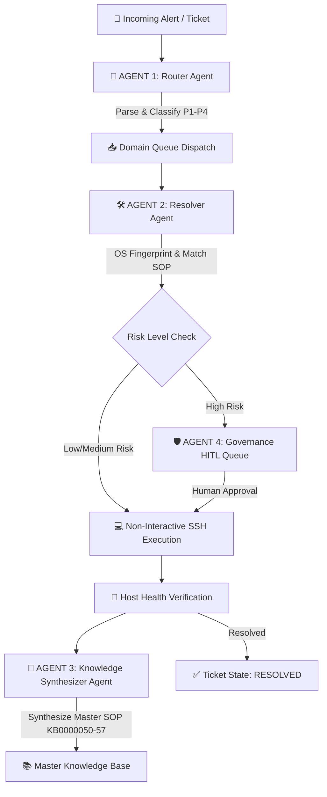

# 🚀 Enterprise ITSM Platform & Autonomous Multi-Agent Resolver System

[](https.mit-license.org)
[](https://nodejs.org)
[](https://python.org)
[](#-autonomous-4-agent-pipeline)

An end-to-end, enterprise-grade **IT Service Management (ITSM) Platform** equipped with an **Autonomous 4-Agent AI Engine** capable of automated ticket routing, non-interactive SSH remote remediation, live host health verification, master SOP synthesis, and strict Human-in-the-Loop (HITL) governance.

---

## 📐 Autonomous 4-Agent Pipeline



### 🤖 Core Agent Roles & Capabilities

| Agent Role | Model Engine | Primary Responsibilities |
| :--- | :--- | :--- |
| **1. 🚦 Router Agent** | `Llama-3.3-70B-Instruct` | Parses symptoms, classifies categories/subcategories, assigns priority (P1–P4 matrix), and dispatches tickets to domain queues. |
| **2. 🛠️ Resolver Agent** | `Llama-3.3-70B-Instruct` + SSH Engine | Remote OS fingerprinting (`uname -s`), runbook matching, executing 100% non-interactive shell commands on target hosts, and host health verification. |
| **3. 🧠 Knowledge Synthesizer** | `DeepSeek-R1` / `GPT-4o` | Deep reasoning, root-cause analysis, pattern & trend detection, and consolidating tickets into generic Master Domain SOPs (KB0000050–KB0000057). |
| **4. 🛡️ Agent Governance** | `GPT-4o` + Safety Engine | Evaluates command risk levels (HIGH vs. LOW/MEDIUM), manages Human-in-the-Loop approval workflows, and logs full audit traces in `agent_history.json`. |

---

## 📚 Master Generic Domain SOPs

The platform enforces **Master Knowledge Deduplication & Consolidation**, preventing duplicate standalone KB articles and grouping recurring requests into consolidated master SOP domain articles:

1. **`KB0000050`**: Master SOP for Generic User Account Deletion & Offboarding
2. **`KB0000051`**: Master SOP for Database Connection Pool Exhaustion & Vacuum Optimization
3. **`KB0000052`**: Master SOP for Unix Disk Space Recovery, Journalctl Vacuum & Syslog Truncation
4. **`KB0000053`**: Master SOP for Kubernetes Ingress Controller Pod Autoscaling & Traffic Throttling
5. **`KB0000054`**: Master SOP for BGP Routing Cache Flush & Network Gateway Latency Recovery
6. **`KB0000055`**: Master SOP for Unix Kernel Contention, Process Kill & Virtual Memory Flush
7. **`KB0000056`**: Master SOP for Application SSO Authentication & Webhook Timeout SOP
8. **`KB0000057`**: Master SOP for Generic Docker & Container Runtime Provisioning & Installation

---

## 🛠️ Technology Stack

- **Frontend**: Next.js 14, React 18, TailwindCSS, Lucide Icons, Glassmorphism UX (`http://localhost:3000`).
- **Backend API**: NestJS, TypeScript, SingleDatabase Master Service, Prisma, REST API (`http://localhost:4000/api/v1`).
- **Autonomous Agents**: Python 3.10+, Paramiko SSH Engine, GenAI Lab MaaS (`https://genailab.tcs.in/v1`).
- **Governance Portal**: Standalone Vite + React Governance Dashboard (`http://localhost:5173`).

---

## ⚡ Quickstart Guide

### 1. Start NestJS Backend Server (Port 4000)
```bash
cd apps/backend
npm run start:dev
```

### 2. Start Next.js ITSM Frontend Portal (Port 3000)
```bash
cd apps/frontend
npm run dev
```

### 3. Start Standalone Agent Governance Dashboard (Port 5173)
```bash
cd "Resolver Agent/agent-approval-dashboard"
npx vite --port 5173
```

### 4. Launch Continuous Autonomous Agent Daemon
```bash
cd "Resolver Agent"
python continuous_itsm_agent_daemon.py
```

---

## 🌐 Port Mapping Summary

| Service Name | Port | Description |
| :--- | :--- | :--- |
| **ITSM Frontend Portal** | `http://localhost:3000` | Incident, Problem, Change, and Knowledge Management Platform |
| **ITSM Backend API** | `http://localhost:4000/api/v1` | REST API, Single Database Service, OpenAPI Docs (`/api/docs`) |
| **Agent Governance UI** | `http://localhost:5173` | Standalone Agent Governance, Approvals & Execution Audit History |

---

## 📄 License

Distributed under the MIT License. See `LICENSE` for details.
