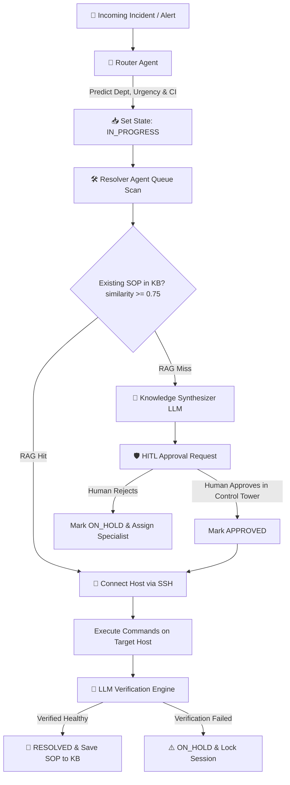

# 🚀 Enterprise ITSM Platform & Autonomous Multi-Agent Resolver System

[](https://mit-license.org)
[](https://nodejs.org)
[](https://python.org)
[](https://postgresql.org)
[](#-autonomous-4-agent-pipeline)

An end-to-end, enterprise-grade **IT Service Management (ITSM) Platform** equipped with an **Autonomous Multi-Agent AI Engine** capable of automated ticket routing, non-interactive SSH remote remediation, live host health verification, master SOP synthesis, state machine loop protection, and strict Human-in-the-Loop (HITL) governance.

---

## 📐 Autonomous Agent Pipeline & Governance Architecture



### 🤖 Core Agent Roles

| Agent | Engine | Responsibilities |
|:---|:---|:---|
| **🚦 Router Agent** | NVIDIA Nemotron 3 550B | Parse symptoms, predict departments/CIs, set SLA priority, transition to `IN_PROGRESS` |
| **🛠️ Resolver Agent** | Python Daemon + Paramiko SSH | OS fingerprinting, non-interactive SSH execution, live health verification |
| **🧠 Knowledge Synthesizer** | NVIDIA Nemotron 3 550B / DeepSeek | Root-cause analysis, synthesize SOPs on RAG miss, auto-persist runbooks |
| **🛡️ HITL Control Tower** | Vite + React + NestJS | Risk evaluation, interactive approval cards, session locks |

---

## 🌐 Services & Port Mapping

| Service | Port | URL | Description |
|:---|:---|:---|:---|
| **PostgreSQL** | `5432` | `localhost:5432` | Primary database (1000+ incidents, KB articles, governance logs) |
| **NestJS Backend** | `4000` | `http://localhost:4000/api/v1` | Core REST API + Swagger docs |
| **Next.js Frontend** | `3000` | `http://localhost:3000` | Incident, Problem, Change, CMDB portal |
| **Control Tower** | `5173` | `http://localhost:5173` | HITL approval queue, history audit, vector map |
| **Auto-Resolver Daemon** | — | Python process | Autonomous SSH remediation agent |

---

## 🖥️ Infrastructure & Configuration Items

### Registered CIs

| CI Name | Class | OS | IP Address | Status |
|:---|:---|:---|:---|:---|
| **Control Plane** | Linux Server | Ubuntu | `192.168.100.101` | OPERATIONAL |
| **WorkerNode1HL** | Linux Server | Ubuntu | `192.168.100.102` | OPERATIONAL |
| **Venuvgp19** | Windows Workstation | Windows 11 | `192.168.100.99` / `192.168.100.42` | OPERATIONAL |

### Daemon CI Credentials

| CI Key | IP | SSH User | OS |
|:---|:---|:---|:---|
| `Control Plane` / `192.168.100.101` | 192.168.100.101 | root / root123 | Unix / Linux |
| `WorkerNode1HL` / `192.168.100.102` | 192.168.100.102 | root / root123 | Unix / Linux |
| `Venuvgp19` / `192.168.100.99` | 192.168.100.99 | Administrator / admin123 | Windows 11 |
| `192.168.100.42` | 192.168.100.42 | Administrator / admin123 | Windows 11 |

---

## 📚 Knowledge Base Articles (SOPs)

| KB Number | Title | Category | Score |
|:---|:---|:---|:---|
| **KB0000001** | Master User Account Creation & Provisioning SOP | User Management | 0.9850 |
| **KB0000003** | NexaCore Application Restart SOP (Port 8080) | Application Recovery | 0.9500 |
| **KB0000014** | User Account Offboarding & Deletion SOP | User Management | 0.9750 |
| **KB0000015** | User Account Lock & Unlock SOP | User Management | 0.9750 |
| **KB0000017** | User Password Reset SOP | User Management | 0.9750 |
| **KB0000018** | User Account Modification (Shell/Groups) SOP | User Management | 0.9750 |
| **KB0000019** | NexaCore Application Recovery - Detailed | Application Recovery | 0.9500 |
| **KB0000020** | NexaCore Application Recovery - Generic | Application Recovery | 0.9500 |
| **KB0000021** | Disk Cleanup SOP | Infrastructure | 0.9000 |
| **KB0000022** | Service Restart SOP | Infrastructure | 0.9000 |
| **KB0000023** | DNS Resolution SOP | Infrastructure | 0.9000 |
| **KB0000024** | SSL Certificate Renewal SOP | Security | 0.9000 |
| **KB0000025** | NTP Sync SOP | Infrastructure | 0.9000 |
| **KB0000026** | Memory Cleanup SOP | Infrastructure | 0.9000 |
| **KB0000027** | Log Rotation SOP | Infrastructure | 0.9000 |
| **KB0000028** | User Account Modification - Generic | User Management | 0.9000 |

---

## 🔒 Daemon Safety Rules

### User Creation (KB0000001)
- **Username validation gate**: First command must be `id -u {username}` — aborts if username already exists
- **Sudo stripping**: If ticket does NOT request sudo → sudoers commands are removed
- **ACL mode**: If ticket requests "write access to /etc" (not full sudo) → replaced with `setfacl -R -m u:{username}:rwx {target_dir}`
- **Force-change stripping**: If ticket does NOT request force password change → `passwd -e` is removed

### User Deletion (KB0000014)
- Archive before delete: `tar czf /tmp/{username}_home.tar.gz /home/{username}`
- Kill processes before delete: `pkill -u {username}`

### Password Reset (KB0000017)
- Force-change: If "force" or "expire" mentioned → `passwd -e {username}` appended
- Default: just `echo {username}:{password} | chpasswd`

### Lock/Unlock (KB0000015)
- Lock keywords: "lock", "disable", "brute force" → `passwd -l {username}`
- Unlock keywords: "unlock", "enable" → `passwd -u {username}`

### Modify User (KB0000018)
- Shell change: `chsh -s {shell} {username}`
- Group add: `usermod -aG {group} {username}`
- Group remove: `gpasswd -d {username} {group}`

---

## 🗄️ Database Schema

### Core Tables

| Table | Records | Description |
|:---|:---|:---|
| `Incident` | 1000+ | All incident tickets with state machine |
| `KnowledgeArticle` | 18+ | SOPs, runbooks, diagnostic procedures |
| `AgentApproval` | 100+ | HITL approval requests and decisions |
| `AgentHistory` | 100+ | Agent execution audit trail |
| `ConfigurationItem` | 3+ | CIs (servers, workstations) |
| `Problem` | — | Problem management records |
| `ChangeRequest` | — | Change management records |
| `User` | — | Platform users |
| `Tenant` | 1 | Multi-tenant isolation |

### Incident Activity Timeline
Each incident has an `activitiesJson` array containing:
```json
{
  "id": "act_1785620050168",
  "author": "🤖 Unix Auto-Resolver Agent",
  "comment": "SOP executed successfully...",
  "isWorkNote": true,
  "timestamp": "12:34:56 PM"
}
```

---

## 🔌 API Endpoints

### Incidents
| Method | Endpoint | Description |
|:---|:---|:---|
| `GET` | `/api/v1/incidents` | List all incidents |
| `GET` | `/api/v1/incidents/:id` | Get incident details |
| `POST` | `/api/v1/incidents` | Create new incident |
| `PATCH` | `/api/v1/incidents/:id` | Update incident state/priority |
| `POST` | `/api/v1/incidents/:id/activities` | Add work note |
| `DELETE` | `/api/v1/incidents/:id/activities/:activityId` | Delete work note |

### Agent Governance
| Method | Endpoint | Description |
|:---|:---|:---|
| `GET` | `/api/v1/agent/approvals` | List approval requests |
| `POST` | `/api/v1/agent/approvals` | Create approval request |
| `POST` | `/api/v1/agent/approvals/:id/approve` | Approve SOP |
| `POST` | `/api/v1/agent/approvals/:id/reject` | Reject SOP |
| `GET` | `/api/v1/agent/history` | Agent execution history |
| `DELETE` | `/api/v1/agent/history/:id` | Delete history entry |
| `POST` | `/api/v1/agent/reset-locks` | Reset stuck locks |

### Knowledge Base
| Method | Endpoint | Description |
|:---|:---|:---|
| `GET` | `/api/v1/knowledge/articles` | List KB articles |
| `POST` | `/api/v1/knowledge/articles` | Create KB article |
| `PUT` | `/api/v1/knowledge/articles/:id` | Update KB article |
| `DELETE` | `/api/v1/knowledge/articles/:id` | Delete KB article |

### CMDB
| Method | Endpoint | Description |
|:---|:---|:---|
| `GET` | `/api/v1/cmdb/ci` | List all CIs |
| `POST` | `/api/v1/cmdb/ci` | Register new CI |
| `GET` | `/api/v1/cmdb/ci/:id` | Get CI details |

---

## 🚀 Quick Start

### 1. Clone & Install
```bash
git clone https://github.com/Venuvgp19/ITSM-Agentic.git
cd ITSM-Agentic
npm install
cd "Resolver Agent" && pip install -r requirements.txt && cd ..
```

### 2. Start PostgreSQL (Portable)
```powershell
& "$env:USERPROFILE\pgsql\pgsql\bin\postgres.exe" -D "$env:USERPROFILE\pgsql\pgsql\data"
```

### 3. Restore Database from Dump
```bash
psql -h 127.0.0.1 -U itsm_user -d itsm_db -f packages/db/prisma/seed-data.sql
```

### 4. Start All Services
```powershell
# Backend
npm run dev:backend

# Frontend
cd apps/frontend && npm run dev

# Control Tower
cd "Resolver Agent/agent-approval-dashboard" && npx vite --port 5173

# Auto-Resolver Daemon
cd "Resolver Agent" && python continuous_itsm_agent_daemon.py
```

### 5. Verify
```bash
# Check all ports
@(5432, 4000, 3000, 5173) | ForEach-Object {
    $l = Get-NetTCPConnection -LocalPort $_ -ErrorAction SilentlyContinue | Where-Object { $_.State -eq 'Listen' } | Select-Object -First 1
    if ($l) { "Port $_ : OK" } else { "Port $_ : DOWN" }
}
```

---

## 🛡️ Safety Directives

- **State Machine**: `NEW` → `IN_PROGRESS` → `PENDING_APPROVAL` → `APPROVED` → `RESOLVED` / `ON_HOLD`
- **Session Locking**: Escalated incidents get in-memory session locks preventing daemon re-polling
- **Database Integrity**: Backend preserves all tables/schemas on restart — no destructive resets
- **HITL Gate**: HIGH risk commands require human approval in Control Tower before execution
- **SOP Parameterization**: LLM replaces `{ip}`, `{username}`, `{password}` placeholders with ticket-specific values

---

## 📄 License

Distributed under the MIT License. See `LICENSE` for details.
