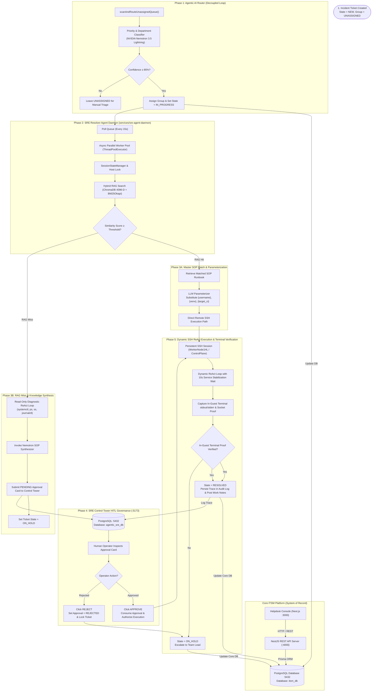

# 🚀 Enterprise Autonomous ITSM Platform & Agentic SRE Control Tower

An enterprise-grade, autonomous **IT Service Management (ITSM) Platform** powered by a **Multi-Agent Artificial Intelligence Engine** and **NVIDIA NIM LLMs** (NVIDIA Nemotron 3.5 Lightning, Llama 3.3 70B, DeepSeek R1).

The platform automates enterprise helpdesk and Site Reliability Engineering operations end-to-end: autonomous ticket routing and classification, Hybrid Dense & Lexical Vector RAG (ChromaDB 4096-D NV-Embed-v1 + BM25Okapi via Reciprocal Rank Fusion), loop-aware command validation, remote persistent SSH remediation, autonomous in-guest terminal verification, self-learning SOP synthesis, and Human-in-the-Loop (HITL) governance through the **Agent Control Tower Dashboard**.

---

## 📋 Table of Contents
1. [Key Features & Platform Capabilities](#-key-features--platform-capabilities)
2. [Multi-Agent System Architecture](#-multi-agent-system-architecture)
3. [Repository & Service Structure](#-repository--service-structure)
4. [Modular SRE Resolver Agent Daemon](#-modular-sre-resolver-agent-daemon)
5. [Agent Control Tower & HITL Governance](#-agent-control-tower--hitl-governance)
6. [Hybrid RAG & SOP Synthesis Engine](#-hybrid-rag--sop-synthesis-engine)
7. [Safety, Validation & Guardrails](#-safety-validation--guardrails)
8. [Active Service URLs & Port Reference](#-active-service-urls--port-reference)
9. [Installation & Application Startup Directives](#-installation--application-startup-directives)
10. [Database Management & Integrity](#-database-management--integrity)
11. [License](#-license)

---

## 🌟 Key Features & Platform Capabilities

- **Autonomous Incident Triage & AI Routing**: Real-time evaluation of incoming tickets by priority (P1 Critical to P4 Low), predicting operational assignment groups with high confidence (≥ 85%) and auto-assigning for remediation.
- **Strict Architectural Decoupling**:
  - *Core ITSM Backend* (`:4000`): Pure enterprise system of record with PostgreSQL database (`itsm_db`).
  - *SRE Control Tower & Governance* (`:5173`): Dedicated autonomous AI control plane and database (`agentic_sre_db`) managing approvals, timelines, and execution audit history.
- **Hybrid RAG Retrieval Engine**: Combines dense vector semantic search (4096-D `nvidia/nv-embed-v1` embeddings in ChromaDB) and BM25Okapi lexical retrieval using Reciprocal Rank Fusion (RRF) and an LLM RAG Judge.
- **Generic Master SOP & Dynamic Parameterization**: Reusable parameterized SOP blueprints for Linux user management, Kubernetes/ArgoCD operations, IBM DB2, Jenkins secrets, Cloud CLIs, and Python environments.
- **Dynamic ReAct Execution Loops**:
  - *Read-Only Diagnostic Loop*: Live non-destructive telemetry gathering on target hosts before formulating a solution.
  - *Remediation Loop*: Dynamic SSH command execution guided by approved runbooks with per-turn tool calling and automated 10-second service stabilization pauses.
- **Preemptive Singleton Daemon Locking**: Uses process inspection to guarantee only a single active daemon instance runs at any time, preventing duplicate sessions.
- **In-Guest Terminal Proof Verification**: Remediation is evaluated 100% directly from live SSH execution proof and stdout/stderr output (`ss -tulpn`, `systemctl status`), eliminating dependency on external host network probes.
- **Self-Learning Knowledge Base Synthesizer**: Automatically writes and persists newly discovered and verified SOPs to the knowledge base and indexes them in ChromaDB.
- **Thread-Safe Session & Concurrency Guard**: Centralized session state manager with atomic per-incident locks, per-host serialization mutexes, and token usage accounting.
- **Execution Audit Log**: Real-time telemetry dashboard featuring executive KPI ribbons, 3-Agent pipeline breakdown (Router 🚦, Resolver 🛠️, Synthesizer 🧠), syntax-highlighted commands, and terminal output streams.

---

## 🤖 Multi-Agent System Architecture



---

## 📁 Repository & Service Structure

```
ITSM-Agentic/
├── apps/
│   ├── backend/                    # NestJS Core ITSM API Server (Port 4000)
│   ├── frontend/                   # Next.js 14 ServiceNow Helpdesk Console (Port 3000)
│   └── sre-control-tower/          # SRE Agent Control Tower Dashboard & API (Port 5173)
├── services/
│   └── sre-agent-daemon/           # Python Multi-Agent Autonomous Daemon & Vector DB
│       ├── continuous_itsm_agent_daemon.py
│       └── daemon/
│           ├── config.py           # Preemptive singleton process lock & configs
│           ├── session_state.py    # Per-host lock & thread-safe state manager
│           ├── llm.py              # NVIDIA NIM LLM invocation engine
│           ├── orchestrator/       # Lifecycle state machine & polling loops
│           ├── itsm/               # ITSM API & Control Tower governance clients
│           ├── rag/                # ChromaDB 4096-D dense embeddings & BM25Okapi
│           ├── react/              # Dynamic ReAct remediation loop with sleep wait
│           └── ssh/                # Persistent Paramiko SSH connection manager
├── packages/
│   └── mcp-server/                 # Model Context Protocol (MCP) Tool Integration
└── scripts/
    └── database/                   # Database schemas and baseline dump files
```

---

## 🛡️ Agent Control Tower & HITL Governance

The **SRE Agent Control Tower** (`http://localhost:5173`) provides unified visibility and governance over autonomous agent operations:

1. **Pending Approvals Gate**: High-risk or newly synthesized SOPs require explicit human review and authorization before remote execution.
2. **Execution Observability & Live Timeline**: Real-time step-by-step telemetry tracking RAG lookups, SSH connections, parameterization, and verification status.
3. **Execution Audit Log**:
   - Executive summary cards (Total Traces, Auto-Executed %, HITL Approved, Avg Latency).
   - Multi-agent breakdown (Router 🚦, Resolver 🛠️, Synthesizer 🧠).
   - Syntax-highlighted CLI commands with single-click copy.
   - Live SSH terminal output stream (`stdout` / `stderr`).
4. **Emergency Containment & Kill Switch**: Immediate fleet-wide shutdown toggle to instantly freeze all autonomous agent execution.

---

## 🧠 Hybrid RAG & Master SOP Knowledge Base

### RAG Retrieval Formula
Retrieval combines dense semantic similarity and BM25Okapi lexical matching via Reciprocal Rank Fusion (RRF):

$$\text{RRF Score} = \frac{w_{\text{dense}}}{60 + \text{Rank}_{\text{dense}}} + \frac{w_{\text{lexical}}}{60 + \text{Rank}_{\text{lexical}}}$$

$$\text{Blended Score} = 0.55 \times \text{Dense Score} + 0.45 \times \text{Normalized RRF Score}$$

### Pre-Configured Master SOPs

| IT Domain | Master SOP | Parameter Placeholders | Scope |
| :--- | :--- | :--- | :--- |
| **Linux Application Recovery** | `KB0000039` | `{service_name}`, `{port}` | Systemd daemon-reload, enable --now, 10s wait, socket verification |
| **User Account Provisioning** | `KB0000028` | `{username}`, `{password}`, `{group}` | Standard & privileged Linux user creation |
| **User Account Deprovisioning** | `KB0000038` | `{username_list}`, `{username}` | Single & bulk user deletion, sudoers purge |
| **Cloud CLI / DevOps Tooling** | `KB0000045` | `{ci_name}`, `{os_type}` | Azure CLI installation, package verification |
| **Python Virtual Environments** | `KB0000019` | `{venv_name}`, `{packages}` | Python venv provisioning & package installation |
| **Kubernetes & ArgoCD** | `KB0000026` | `{target_ns}`, `{deployment_name}` | Pod/Deployment health recovery, namespace restarts |
| **Jenkins Secrets & Credentials**| `KB0000041` | `{service_name}`, `{secret_path}` | Initial admin password & credential retrieval |
| **IBM DB2 Management** | `KB0000033` | `{db2_user}`, `{access_level}` | DB2 instance administration, CloudBeaver access |
| **System Performance & Triage** | `KB0468210` | `{ci_name}`, `{threshold_type}` | CPU/Memory pressure triage and process diagnostics |

---

## 🛡️ Safety, Validation & Guardrails

1. **Pre-Execution Catastrophic Blacklist**: Blocks destructive commands (`rm -rf /`, `mkfs`, `dd if=`, `:(){ :|:& };:`, `fdisk`, `reboot`, `shutdown`) before they reach any live host.
2. **Loop-Aware Command Safety Validator**: Parses bash control structures (`for`, `while`, pipes) to ensure every invoked binary is strictly within the approved SOP blueprint.
3. **Mandatory Domain-Aware Proof-of-Fix Guard**: Prevents false resolutions by requiring in-context terminal proof:
   - *User Deletion*: Confirms `id {username}` returns `no such user`.
   - *User Creation*: Confirms `id {username}` returns valid UID/GID and sudo permissions exist.
   - *Service Restarts*: Confirms target port/process is actively listening via `ss -tulpn`.
4. **Autonomous Emergency Abort (Kill Switch)**:
   - Operators can instantly abort running executions via the Control Tower UI.
   - Daemon actively checks containment state and terminates within `< 1.5s`.

---

## ⚡ Active Service URLs & Port Reference

| Service | Port | Technology | URL | Description |
| :--- | :--- | :--- | :--- | :--- |
| **PostgreSQL Database** | `5432` | PostgreSQL | `localhost:5432` | Data stores: `itsm_db` & `agentic_sre_db` |
| **ServiceNow Core UI** | `3000` | Next.js 14 | `http://localhost:3000` | Core Helpdesk & ITSM Portal |
| **ITSM Backend API** | `4000` | NestJS | `http://localhost:4000/api/docs` | System of Record REST API & Swagger |
| **SRE Control Tower** | `5173` | React + Vite + Node | `http://localhost:5173` | HITL Governance, Audit Logs & Telemetry |
| **Python SRE Daemon** | Background | Python 3.10 | Daemon PID | Autonomous Resolver & RAG Engine |
| **ITSM MCP Server** | Background | Node.js | STDIO / SSE | Model Context Protocol Tool Server |

---

## 🛠️ Installation & Application Startup Directives

### 1. Prerequisites
- **Node.js** v18+ & **npm** v9+
- **Python** 3.10+
- **PostgreSQL** 15+ running on port `5432`
- **NVIDIA NIM API Key** configured in `.env` (`NVIDIA_API_KEY`)

### 2. Startup Directives

#### 🟢 Full Application Startup (All Services)
Follow this exact sequence to start all platform components:
```powershell
# 1. Start PostgreSQL
& "$env:USERPROFILE\pgsql\pgsql\bin\postgres.exe" -D "$env:USERPROFILE\pgsql\pgsql\data"

# 2. Build Backend & MCP Server
npm run build:backend
npm run build:mcp

# 3. Start Backend API Server (Port 4000)
node apps/backend/dist/main.js

# 4. Start Next.js Frontend (Port 3000)
npm run dev:frontend

# 5. Start Agent Control Tower (Port 5173)
cd apps/sre-control-tower
node server.js

# 6. Start Python SRE Daemon
cd services/sre-agent-daemon
python -u continuous_itsm_agent_daemon.py

# 7. Start ITSM MCP Server
npm run start:mcp
```

#### 🟡 ServiceNow Core ITSM Only
```powershell
node apps/backend/dist/main.js
npm run dev:frontend
```

#### 🔵 Agentic SRE Services Only (Control Tower & AI Daemon)
```powershell
node apps/sre-control-tower/server.js
python -u services/sre-agent-daemon/continuous_itsm_agent_daemon.py
npm run start:mcp
```

#### 🛑 Full Platform Teardown Sequence
```powershell
# Stop services in reverse order:
# 1. Stop Python Daemon
# 2. Stop MCP Server
# 3. Stop Control Tower (Port 5173)
# 4. Stop Next.js Frontend (Port 3000)
# 5. Stop NestJS Backend (Port 4000)
# 6. Stop PostgreSQL Database (Port 5432)
```

---

## 💾 Database Management & Integrity

- **Database Integrity Policy**: Rebuilding or restarting the backend (`npm run build:backend`) **preserves all existing database records without destructive resets, seeds, or table wipes**.
- **PostgreSQL Databases**:
  - `itsm_db`: Stores standard ITSM entities (`Incident`, `KnowledgeArticle`, `ConfigurationItem`, `User`, `ChangeRequest`).
  - `agentic_sre_db`: Stores SRE governance records (`sre_approvals`, `sre_history`, `sre_timeline`, `sre_containment`).

---

## 📄 License

This project is licensed under the MIT License - see the LICENSE file for details.
