# ??? System Architecture — Enterprise Autonomous ITSM & Agentic SRE Control Tower

This document provides multi-level architectural blueprints for the **Autonomous ITSM Platform & Agentic SRE Control Tower**. You can render these diagrams directly in Markdown viewers, or import the provided syntax into tools like **Eraser.io**, **IcePanel**, **LikeC4**, **D2**, or **Draw.io**.

---

## 1. High-Level C4 Container Diagram (Mermaid)

```mermaid
flowchart TB
    %% STYLES
    classDef client fill:#1e293b,stroke:#3b82f6,stroke-width:2px,color:#f8fafc;
    classDef frontend fill:#0f172a,stroke:#06b6d4,stroke-width:2px,color:#f8fafc;
    classDef backend fill:#1e1b4b,stroke:#8b5cf6,stroke-width:2px,color:#f8fafc;
    classDef daemon fill:#14532d,stroke:#22c55e,stroke-width:2px,color:#f8fafc;
    classDef ai fill:#4c0519,stroke:#f43f5e,stroke-width:2px,color:#f8fafc;
    classDef db fill:#312e81,stroke:#6366f1,stroke-width:2px,color:#f8fafc;
    classDef target fill:#374151,stroke:#9ca3af,stroke-width:2px,color:#f8fafc;

    %% USERS & CLIENTS
    subgraph USERS ["?? Platform Operators & Users"]
        U_END["?? IT End User"]:::client
        U_SRE["??? SRE / Platform Engineer"]:::client
        U_ADMIN["?? Platform Administrator"]:::client
    end

    %% PRESENTATION TIER
    subgraph PRESENTATION ["??? Presentation Layer (UI & Dashboards)"]
        UI_CORE["?? Next.js 14 Core Helpdesk UI<br/>(Port :3000)<br/>• Incident Portal & Service Catalog<br/>• Self-Service & Status Page"]:::frontend
        UI_TOWER["??? Agent Control Tower Dashboard<br/>(Port :5173 - React + Vite + SSE)<br/>• HITL Human Approval Cards<br/>• Live Terminal Token Streaming<br/>• Draggable AI SRE Assistant"]:::frontend
    end

    %% SERVICE & BACKEND TIER
    subgraph SERVICES ["?? Application & Orchestration Services"]
        API_CORE["?? NestJS ITSM Backend API<br/>(Port :4000)<br/>• REST API & Swagger OpenAPI<br/>• Incident & Ticket Lifecycle<br/>• Prisma ORM Data Access"]:::backend
        MCP_SERVER["?? ITSM Model Context Protocol (MCP) Server<br/>• Node.js STDIO / SSE Gateway<br/>• Standardized AI Tool Protocol"]:::backend
        SRE_DAEMON["?? Python Autonomous SRE Daemon<br/>(Background Process)<br/>• Continuous Queue Polling (15s)<br/>• Dynamic ReAct Diagnostic Engine<br/>• Parameterized SOP Execution Engine"]:::daemon
    end

    %% AI & KNOWLEDGE RETRIEVAL TIER
    subgraph AI_RAG ["?? AI, RAG & LLM Engine"]
        NVIDIA_NIM["?? NVIDIA NIM Inference Endpoints<br/>• Nemotron 3.5 Lightning (Router/SOP)<br/>• Llama 3.3 70B (Diagnosis)<br/>• DeepSeek R1 (Deep Reasoning)"]:::ai
        HYBRID_RAG["?? Hybrid Dense + Sparse RAG Engine<br/>• 4096-D NV-Embed-v1 Dense Vectors<br/>• BM25Okapi Lexical Search<br/>• Reciprocal Rank Fusion (RRF)<br/>• LLM RAG Judge Verification"]:::ai
        CHROMADB[("?? ChromaDB Vector Store<br/>• 44 Parameterized Master SOPs<br/>• 1,187+ Precedent Incidents<br/>• 218 SRE Execution Traces")]:::db
    end

    %% PERSISTENCE TIER
    subgraph PERSISTENCE ["?? Data Persistence Layer (PostgreSQL :5432)"]
        DB_CORE[("??? itsm_db (PostgreSQL)<br/>• Incidents, Tickets & Tasks<br/>• CI Inventory & Work Notes<br/>• Operator User Accounts")]:::db
        DB_SRE[("??? agentic_sre_db (PostgreSQL)<br/>• HITL Approval State Machine<br/>• Terminal Audit Stream Traces<br/>• Agent Performance Telemetry")]:::db
    end

    %% TARGET INFRASTRUCTURE
    subgraph TARGETS ["?? Managed Target Infrastructure"]
        NODE_LINUX["?? Linux / Kubernetes Worker Nodes<br/>• SSH Remote Access<br/>• Service Daemons & Pods<br/>• Systemd / Journalctl / SS Sockets"]:::target
        NODE_DB["??? Enterprise Databases / CIs<br/>• IBM DB2 / Cloud CLIs / Jenkins"]:::target
    end

    %% INTERACTIONS & FLOWS
    U_END -->|Create Ticket / View Status| UI_CORE
    U_ADMIN -->|Manage Queues & Roles| UI_CORE
    U_SRE -->|Approve / Reject / Live Monitor| UI_TOWER

    UI_CORE -->|REST API Calls| API_CORE
    UI_TOWER -->|SSE Stream & REST| API_CORE
    UI_TOWER -->|Query Approval Cards| DB_SRE

    API_CORE -->|Prisma CRUD| DB_CORE
    API_CORE -->|Tool Interface| MCP_SERVER

    SRE_DAEMON -->|1. Poll UNASSIGNED Queue| DB_CORE
    SRE_DAEMON -->|2. Precedent Grounding & Triage| NVIDIA_NIM
    SRE_DAEMON -->|3. Query SOPs & History| HYBRID_RAG
    HYBRID_RAG <-->|Fetch Embeddings & Docs| CHROMADB
    HYBRID_RAG -->|Generate Embeddings| NVIDIA_NIM

    SRE_DAEMON -->|4A. RAG Hit: Execute SOP| NODE_LINUX
    SRE_DAEMON -->|4B. RAG Miss: Read-Only Probe| NODE_LINUX
    SRE_DAEMON -->|5. Synthesize SOP & Request Approval| DB_SRE
    SRE_DAEMON -->|6. Check Approval Status| DB_SRE
    SRE_DAEMON -->|7. SSH ReAct Remediation| NODE_LINUX
    SRE_DAEMON -->|7. SSH Remediation| NODE_DB

    SRE_DAEMON -->|8. Verify in-guest stdout/stderr| NODE_LINUX
    SRE_DAEMON -->|9. Update Ticket = RESOLVED| DB_CORE
    SRE_DAEMON -->|10. Persist Verified Trace & KB| DB_SRE
    SRE_DAEMON -->|11. Index New SOP| CHROMADB
```



---

## 2. End-to-End Autonomous Incident Resolution Flow (Sequence)

```mermaid
sequenceDiagram
    autonumber
    actor User as User / Monitoring System
    participant CoreAPI as NestJS Core API (:4000)
    participant CoreDB as itsm_db (PostgreSQL)
    participant Daemon as Python SRE Daemon
    participant RAG as Hybrid Vector RAG (ChromaDB)
    participant NIM as NVIDIA NIM (Nemotron 3.5)
    participant Target as Remote Target CI (SSH)
    participant SRE_DB as agentic_sre_db (PostgreSQL)
    participant Tower as Control Tower UI (:5173)
    actor SRE as Human SRE Lead

    User->>CoreAPI: POST /incidents (Create Incident)
    CoreAPI->>CoreDB: INSERT Ticket (State: NEW, Group: UNASSIGNED)
    
    rect rgb(20, 40, 60)
    note over Daemon, NIM: Phase 1: Precedent Grounding & Router
    Daemon->>CoreDB: Poll Unassigned Queue
    Daemon->>NIM: Ground with 1,187+ past incident precedents
    NIM-->>Daemon: Route: "Infrastructure SRE", Priority: P1 (Confidence 96%)
    Daemon->>CoreDB: UPDATE Ticket (Group: SRE, State: IN_PROGRESS)
    end

    rect rgb(30, 60, 40)
    note over Daemon, RAG: Phase 2: Hybrid RAG Search & SOP Retrieval
    Daemon->>RAG: Hybrid Query (Dense 4096-D + BM25Okapi)
    alt High Confidence SOP Hit (Score >= 0.85)
        RAG-->>Daemon: Matched Master SOP (e.g. Linux Systemd Crash)
        Daemon->>NIM: Dynamic Parameterization ({service}, {user}, {port})
        Daemon->>Target: Execute Remediation Commands via SSH
    else RAG Miss (Novel / Unknown Incident)
        Daemon->>Target: Read-Only Diagnostic ReAct Loop (systemctl, ss, ps)
        Target-->>Daemon: Return Diagnostic Logs & Telemetry
        Daemon->>NIM: Synthesize New Remediation SOP
        NIM-->>Daemon: Proposed SOP Plan & Remediation Script
        Daemon->>SRE_DB: INSERT Approval Card (State: PENDING)
        Daemon->>CoreDB: UPDATE Ticket (State: ON_HOLD)
        
        rect rgb(60, 20, 30)
        note over Tower, SRE: Phase 3: Human-in-the-Loop (HITL) Governance
        Tower->>SRE_DB: Stream Pending Approvals
        SRE->>Tower: Inspect Diff, Telemetry & Click "APPROVE"
        Tower->>SRE_DB: UPDATE Approval (State: APPROVED, By: Venu)
        end

        Daemon->>SRE_DB: Poll Approval Status -> APPROVED
        Daemon->>Target: Execute Approved Dynamic ReAct Remediation
    end
    end

    rect rgb(40, 30, 60)
    note over Daemon, Target: Phase 4: In-Guest Terminal Verification
    Daemon->>Target: In-Guest Socket & Service Verification (ss -tulpn, systemctl status)
    Target-->>Daemon: Verified Active & Listening
    Daemon->>CoreDB: UPDATE Ticket (State: RESOLVED, Resolution Notes Posted)
    Daemon->>SRE_DB: INSERT Complete SRE Execution Audit Trace
    Daemon->>RAG: Index Verified SOP into ChromaDB for Future Zero-Touch Runs
    end
```



---

## 3. D2 Engine Code (For D2 / Terrastruct)

```d2
direction: right

users: Platform Operators {
  end_user: End User
  sre_lead: SRE Lead
}

presentation: Presentation Tier {
  core_ui: Next.js Helpdesk (:3000) {
    shape: rectangle
    style.fill: "#0f172a"
    style.stroke: "#06b6d4"
    style.font-color: "#ffffff"
  }
  control_tower: SRE Control Tower (:5173) {
    shape: rectangle
    style.fill: "#0f172a"
    style.stroke: "#f59e0b"
    style.font-color: "#ffffff"
  }
}

services: Backend & Automation Tier {
  backend_api: NestJS REST API (:4000) {
    shape: rectangle
    style.fill: "#1e1b4b"
    style.stroke: "#8b5cf6"
    style.font-color: "#ffffff"
  }
  sre_daemon: Python SRE Daemon {
    shape: rectangle
    style.fill: "#14532d"
    style.stroke: "#22c55e"
    style.font-color: "#ffffff"
  }
  mcp: ITSM MCP Server {
    shape: rectangle
    style.fill: "#1e1b4b"
    style.stroke: "#a855f7"
    style.font-color: "#ffffff"
  }
}

ai_tier: AI & RAG Layer {
  nvidia: NVIDIA NIM LLMs {
    shape: cloud
    style.fill: "#4c0519"
    style.stroke: "#f43f5e"
    style.font-color: "#ffffff"
  }
  hybrid_rag: Hybrid RAG Engine {
    shape: rectangle
  }
  chromadb: ChromaDB Vector Store {
    shape: cylinder
    style.fill: "#312e81"
  }
}

data_tier: Database Layer (PostgreSQL :5432) {
  itsm_db: itsm_db (Core) {
    shape: cylinder
    style.fill: "#312e81"
  }
  sre_db: agentic_sre_db (Governance) {
    shape: cylinder
    style.fill: "#312e81"
  }
}

targets: Managed Target Nodes {
  linux_node: Linux Worker Node {
    shape: rectangle
  }
}

users.end_user -> presentation.core_ui: Submit Tickets
users.sre_lead -> presentation.control_tower: HITL Governance & Monitoring

presentation.core_ui -> services.backend_api: REST API
presentation.control_tower -> data_tier.sre_db: Read Approvals / SSE
presentation.control_tower -> services.backend_api: Proxy Queries

services.backend_api -> data_tier.itsm_db: Prisma ORM
services.backend_api -> services.mcp: MCP Protocol

services.sre_daemon -> data_tier.itsm_db: Poll Queue
services.sre_daemon -> ai_tier.hybrid_rag: Vector / Lexical Search
ai_tier.hybrid_rag <-> ai_tier.chromadb: Embeddings
services.sre_daemon -> ai_tier.nvidia: Reasoning & Parameterization
services.sre_daemon -> data_tier.sre_db: Submit HITL Cards
services.sre_daemon -> targets.linux_node: Remote SSH ReAct Loop
```
